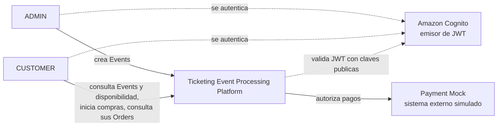
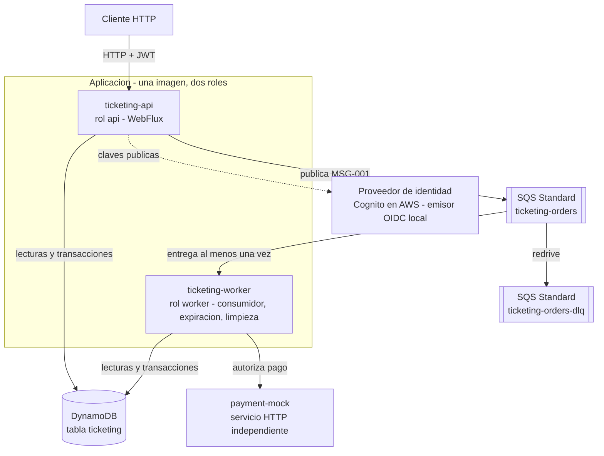
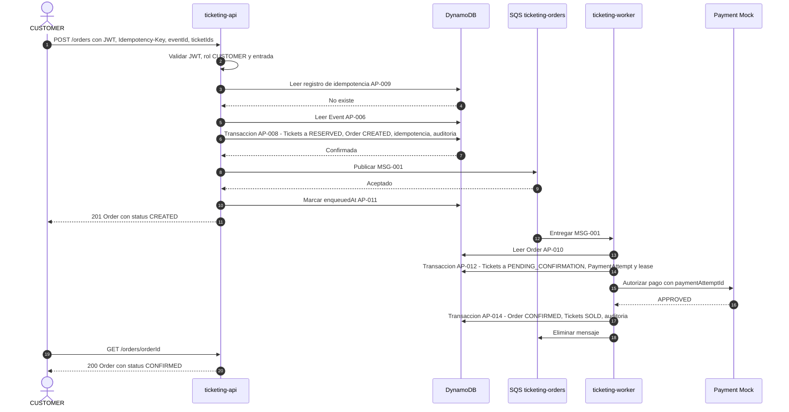
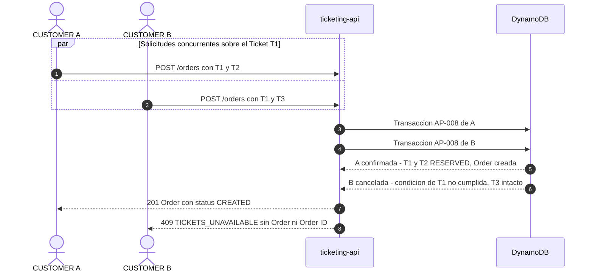
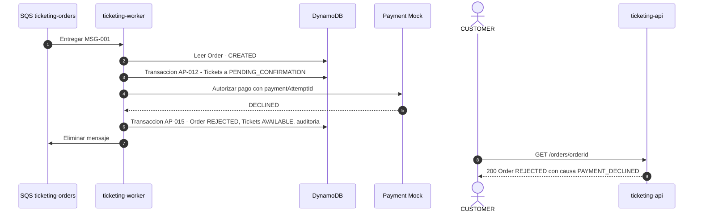
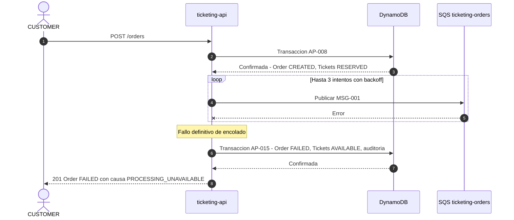
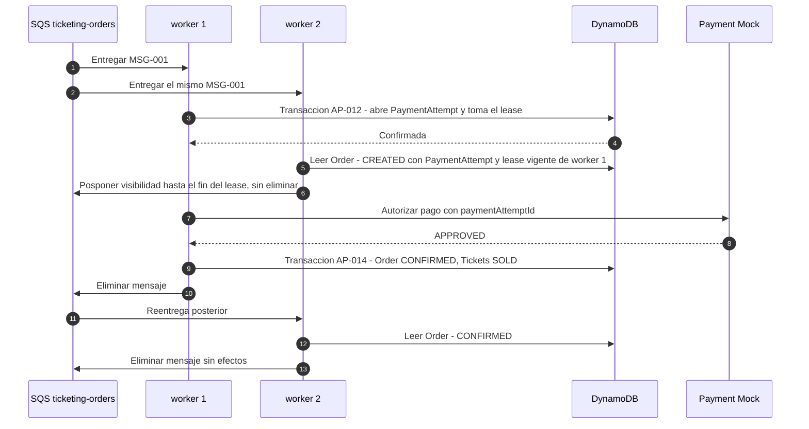
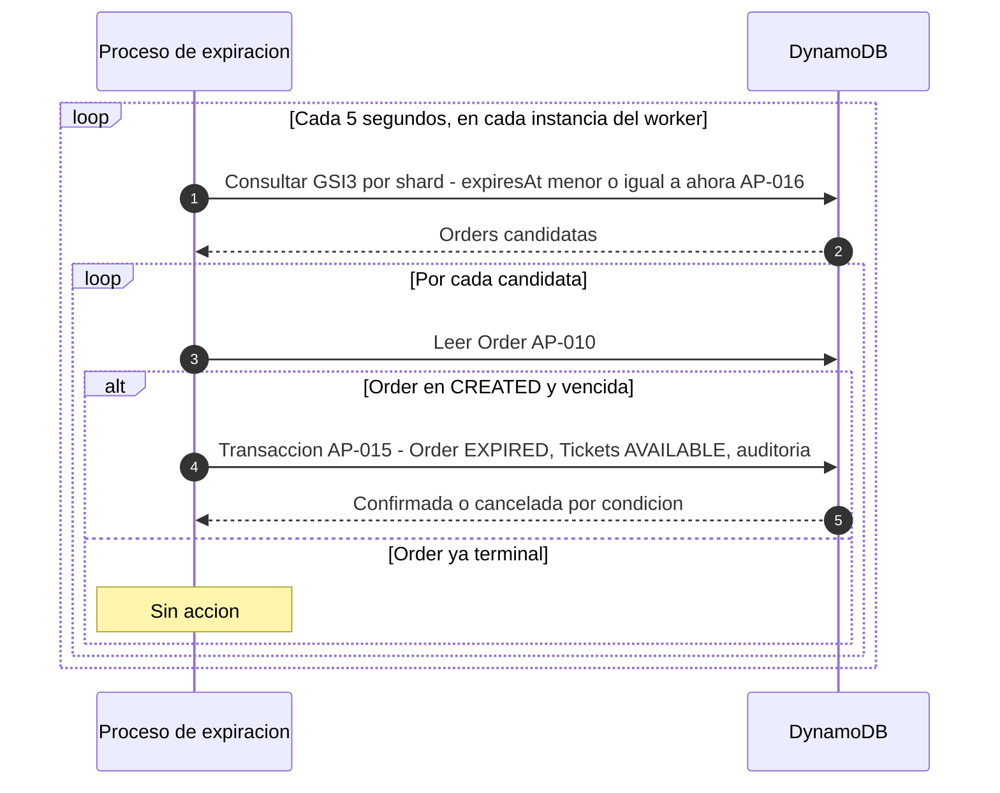
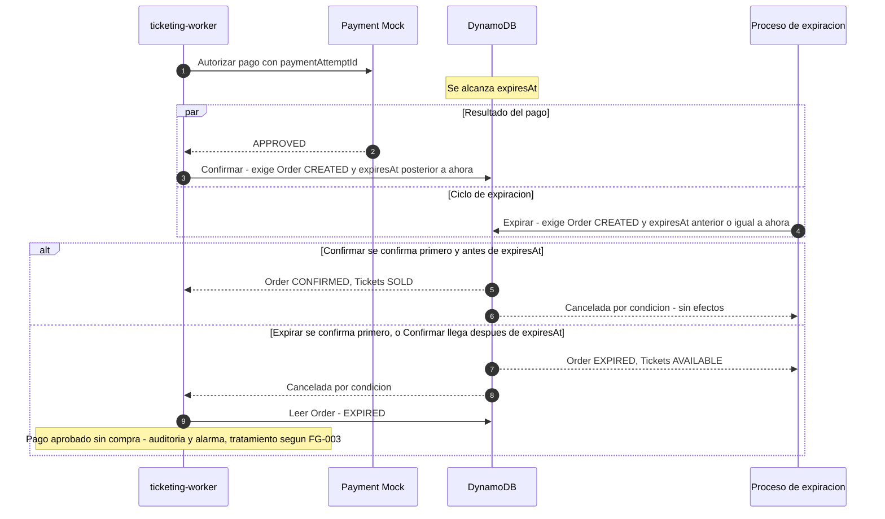

# Architecture — Ticketing Event Processing

Artefactos vigentes de esta versión:

| Artefacto | Ruta | Versión |
|---|---|---|
| Arquitectura | `architecture/ticketing.architecture.md` | 1 |
| Decisiones | `architecture/adr/ADR-001` a `ADR-021` | PROPOSED |
| Modelo de datos | `architecture/ticketing.data-model.md` | 1 |
| Contrato HTTP | `architecture/ticketing.openapi.yaml` | 1 |
| Mensajería | `architecture/ticketing.messaging.md` | 1 |
| Topología AWS | `architecture/ticketing.aws-target.md` | 1 |
| Revisión humana | `human-review/ticketing.architecture-review.yaml` | PENDING |

Precondición verificada en el frontmatter de la Feature Specification v4: `status: READY_FOR_ARCHITECTURE`, `architecture_can_start: true`, `blocking_questions: 0`.

Todas las decisiones están en estado `PROPOSED`. Este documento referencia los ADR; no repite sus alternativas ni su justificación. Los valores numéricos son valores iniciales configurables.

## 1. Overview

El sistema es un backend reactivo con dos roles de ejecución sobre una misma aplicación:

- **`api`**: expone cinco operaciones HTTP. La operación de inicio de compra revalida y reserva atómicamente todos los Ticket, crea la Order con su Reservation, publica un mensaje y responde con el Order ID sin esperar el pago.
- **`worker`**: consume los mensajes, coordina el Payment Mock y cierra la Order y sus Ticket de forma coherente; además ejecuta el proceso periódico de expiración de Reservation.

La persistencia es una tabla de Amazon DynamoDB; la mensajería es una cola Amazon SQS Standard con DLQ; la identidad la emite Amazon Cognito y el backend la valida como Resource Server.

Tres ideas sostienen el diseño:

1. **Cada transición de negocio es una única escritura transaccional condicional** que incluye la Order, todos sus Ticket y su registro de auditoría (ADR-002, ADR-005, ADR-012). No hay estados intermedios ni resultados parciales.
2. **La Order es el guardián**: toda transición terminal exige que la Order esté en `CREATED`. Pago, rechazo, fallo y expiración compiten y exactamente uno gana (ADR-005, ADR-008).
3. **La expiración es la red de seguridad**: cualquier Order que no llegue a un estado terminal por otra vía se cierra al vencer su Reservation (ADR-006, ADR-009, ADR-010).

No se introduce ningún estado de negocio nuevo en Ticket ni en Order. Las fases internas se distinguen con atributos técnicos (`enabled`, `enqueuedAt`, `paymentAttemptId`, `paymentLease*`).

## 2. Architectural drivers

| Driver | Source IDs | Design response |
|---|---|---|
| Cero sobreventa y cero venta duplicada bajo concurrencia | FR-010, BR-008, VAL-004, NFR-004, AC-007, AC-029 | Escritura condicional por Ticket dentro de una transacción (ADR-002) |
| Todo o nada en cada transición | FR-013, FR-016, BR-009, BR-013, AC-014, AC-016 | Una escritura transaccional por transición de negocio (ADR-005) |
| Respuesta síncrona breve con procesamiento asíncrono | FR-005, FR-006, FR-007, NFR-002, AC-003, AC-031 | Reserva síncrona, publicación directa en SQS y consumidor separado (ADR-006, ADR-010) |
| Entrega al menos una vez sin efectos duplicados | FR-017, TC-010, NFR-015, AC-023 a AC-025 | Idempotency key transaccional, estado de la Order como identidad del trabajo, lease de PaymentAttempt (ADR-007) |
| Reservation de máximo diez minutos | BR-002, VAL-001, FR-011, AC-008, AC-009 | `expiresAt` como autoridad, guardas temporales y proceso periódico sobre índice disperso (ADR-008, ADR-009) |
| Sin reservas indefinidas ante fallos | ALT-006, ERR-007, ERR-008, AC-021, AC-022 | Compensación síncrona del encolado, cierre en el último reintento y expiración como red de seguridad (ADR-006, ADR-010) |
| Disponibilidad coherente con los Ticket y rápida | FR-003, FR-012, BR-012, BR-018, AC-010, AC-030 | Lectura derivada de los Ticket, sin contadores (ADR-021) |
| Autenticación, roles y aislamiento de Orders | FR-018, FR-019, BR-023, VAL-011, AC-027, AC-028 | Resource Server, autorización por rol en la entrada y por propiedad en el caso de uso (ADR-013) |
| Auditabilidad de las transiciones | FR-014, BR-010, NFR-005, AC-015 | Registro de auditoría en la misma transacción (ADR-012) |
| No bloqueo | NFR-003, TC-003, TC-008 | WebFlux, clientes asíncronos, consumidor reactivo (ADR-020, ADR-016) |
| Clean Architecture y mantenibilidad | TC-007, TC-013, TC-015, NFR-012 | Módulos con dependencias impuestas por el compilador (ADR-015) |
| Entorno local completo | TC-006, TC-012, DEL-005 | Docker Compose con la misma forma que el objetivo (ADR-017, ADR-014) |
| Testabilidad y cobertura | NFR-013, TC-014, DEL-003 | Puerta de cobertura en pruebas sin contenedores, concurrencia por invariante (ADR-019) |
| Stack obligatorio | TC-001, TC-002, TC-004, TC-005, TC-016, TC-017 | Respetado; compatibilidades marcadas `TO_VERIFY` (§13) |

## 3. System context

Actores autónomos internos al sistema: consumidor asíncrono de Orders y proceso de expiración (§4 de la especificación).

## 4. Containers

El detalle de servicios locales está en ADR-017 y el de la topología objetivo en `ticketing.aws-target.md`.

## 5. Components

| ID | Component | Layer | Responsibility | Source IDs |
|---|---|---|---|---|
| CMP-001 | HTTP API entrypoint | Infrastructure (entrada) | Exponer `API-001` a `API-005`, validar sintaxis, extraer la identidad autenticada, traducir a comandos | TC-003, TC-008, FR-001, FR-002, FR-006, FR-009, FR-012 |
| CMP-002 | Security configuration | Infrastructure | Validar el JWT como Resource Server, mapear `cognito:groups` a autoridades, autorizar por rol | FR-018, FR-019, TC-016, AC-028 |
| CMP-003 | Event management use case | Use Cases | Validar y crear un Event completo en dos fases | FR-001, FR-003, BR-016, BR-021, VAL-006 a VAL-009, AC-001, AC-017 |
| CMP-004 | Event catalog and availability use cases | Use Cases | Listar Events futuros habilitados y consultar disponibilidad bajo demanda | FR-002, FR-012, BR-012, BR-018, BR-022, AC-002, AC-010 |
| CMP-005 | Purchase initiation use case | Use Cases | Resolver idempotencia, reservar y crear la Order, encolar, compensar el fallo de encolado | FR-004, FR-005, FR-006, FR-010, FR-016, FR-017, AC-003, AC-004, AC-016, AC-022 |
| CMP-006 | Order query use case | Use Cases | Retornar una Order propia; tratar inexistente y ajena por igual | FR-009, BR-023, VAL-011, AC-006, AC-027 |
| CMP-007 | Order processing use case | Use Cases | Aplicar las reglas de consumo, coordinar el pago y cerrar la Order | FR-007, FR-008, FR-015, FR-017, AC-005, AC-019 a AC-021, AC-023 a AC-025 |
| CMP-008 | Reservation expiration use case | Use Cases | Encontrar Reservation vencidas y ejecutar la transición de expiración | FR-011, VAL-003, AC-008, AC-009 |
| CMP-009 | Domain model | Domain | Event, Ticket, Order, Reservation, PaymentAttempt; máquinas de estado; invariantes; políticas temporales; errores de dominio | DS-001 a DS-010, ST-001 a ST-010, BR-001 a BR-023, invariantes §5.1 |
| CMP-010 | DynamoDB persistence adapter | Infrastructure (salida) | Implementar los access patterns y las transiciones transaccionales condicionales | TC-004, TC-011, NFR-006, FR-013, FR-014 |
| CMP-011 | SQS publisher adapter | Infrastructure (salida) | Publicar `MSG-001` con reintento acotado | TC-005, FR-005 |
| CMP-012 | SQS consumer adapter | Infrastructure (entrada) | Bucle reactivo de recepción, concurrencia acotada, eliminación y visibilidad | TC-005, TC-010, FR-007, NFR-003 |
| CMP-013 | Payment gateway adapter | Infrastructure (salida) | Invocar el Payment Mock de forma idempotente y clasificar su resultado | FR-015, TC-017, BR-020 |
| CMP-014 | Expiration scheduler adapter | Infrastructure (entrada) | Disparar periódicamente `CMP-008` y `CMP-015` sin bloqueo ni solape | FR-011, NFR-003 |
| CMP-015 | Provisioning cleanup use case | Use Cases | Eliminar Events cuya creación quedó incompleta | FR-001, AC-017 |
| CMP-016 | Error translation | Infrastructure (entrada) | Traducir errores de dominio a Problem Details | TC-009, ERR-002, ERR-006, ERR-009 |
| CMP-017 | Request guard | Infrastructure (entrada) | Limitar tasa por identidad y tamaño de solicitud | NFR-010, EVAL-008 |
| CMP-018 | Observability | Infrastructure (transversal) | Logs estructurados, métricas técnicas y de negocio, propagación de traza | NFR-005, EVAL-013 |
| CMP-019 | Payment Mock service | Servicio independiente | Simular aprobación, rechazo y fallo de forma determinista e idempotente | TC-017, FR-015, AC-019 a AC-021 |
| CMP-020 | Local identity provider | Servicio local | Emitir JWT con claims de forma Cognito en el entorno local | TC-016, TC-012 |
| CMP-021 | Bootstrap and configuration | Infrastructure | Componer la aplicación, activar roles `api` y `worker`, cargar configuración por entorno | TC-002, TC-007, TC-012 |

## 6. Ports

| Port | Direction | Purpose | Implemented by |
|---|---|---|---|
| Create Event | Entrada | Crear un Event con su inventario | CMP-003 |
| List Events | Entrada | Listar Events futuros habilitados | CMP-004 |
| Get Event availability | Entrada | Consultar disponibilidad bajo demanda | CMP-004 |
| Start purchase | Entrada | Iniciar formalmente una compra | CMP-005 |
| Get Order | Entrada | Consultar una Order propia | CMP-006 |
| Process Order | Entrada | Procesar el trabajo asíncrono de una Order | CMP-007 |
| Expire Reservations | Entrada | Ejecutar un ciclo de expiración | CMP-008 |
| Clean up provisioning Events | Entrada | Ejecutar un ciclo de limpieza | CMP-015 |
| Event catalog | Salida | Crear, habilitar, obtener y listar Events; sondear agotado; localizar y eliminar incompletos | CMP-010 |
| Ticket inventory | Salida | Escribir el inventario inicial; leer los Ticket de un Event | CMP-010 |
| Order lifecycle store | Salida | Ejecutar atómicamente las transiciones de negocio y devolver un resultado tipado | CMP-010 |
| Order reader | Salida | Obtener una Order; buscar Reservation vencidas | CMP-010 |
| Idempotency store | Salida | Obtener el registro de idempotencia | CMP-010 |
| Order queue publisher | Salida | Publicar `MSG-001` | CMP-011 |
| Payment gateway | Salida | Autorizar un PaymentAttempt (cancelarlo depende de FG-003) | CMP-013 |
| Clock | Salida | Instante actual | Adaptador de sistema en CMP-021 |
| Id generator | Salida | Identificadores aleatorios | Adaptador de sistema en CMP-021 |

Los adaptadores de entrada (CMP-001, CMP-012, CMP-014) invocan puertos de entrada. Dirección de dependencias y reglas de frontera: ADR-015.

## 7. Critical flows

Convenciones: `AP-*` remite a `ticketing.data-model.md`; `MSG-001` a `ticketing.messaging.md`; las transiciones a §8.

### 7.1 Purchase — happy path

La respuesta 201 se envía sin esperar al Payment Mock (FR-006, AC-003). Decisiones: ADR-002, ADR-005, ADR-006, ADR-007.

### 7.2 Purchase — ticket unavailable

Si la cancelación de B se debe a un conflicto transaccional y no a la condición, B reintenta la transacción hasta 2 veces; en el reintento encuentra T1 en `RESERVED` y recibe 409. Nada queda persistido para B: ni Reservation, ni Order, ni registro de idempotencia (HC-001, AC-016). Decisiones: ADR-002, ADR-016; repetición de la solicitud rechazada: FG-004.

### 7.3 Purchase — payment rejected

Variante de fallo técnico: ante errores transitorios del proveedor el mensaje no se elimina y se reintenta con backoff; en la última recepción permitida la Order pasa a `FAILED` con causa `PROCESSING_FAILED` y los Ticket vuelven a `AVAILABLE` (AC-021). Decisiones: ADR-005, ADR-010, ADR-011.

### 7.4 Purchase — enqueue failure

Casos límite (publicación ambigua, doble fallo, caída del proceso entre el commit y la publicación): ADR-006. En ninguno queda una Reservation indefinida; el peor resultado es una Order que expira (RISK-003).

### 7.5 Duplicate message

Si ambos consumidores intentan abrir el intento a la vez, solo una transacción AP-012 se confirma; el otro relee y aplica la misma regla. Si worker 1 muere, el lease vence antes de que el mensaje reaparezca y otro consumidor reanuda el mismo PaymentAttempt, que el proveedor trata de forma idempotente (AC-023, AC-024, AC-025). Decisiones: ADR-007, ADR-010.

### 7.6 Reservation expiration

Una Reservation vigente nunca cumple la guarda `expiresAt <= ahora`, aunque el índice la devolviera (AC-009). Con varias instancias, la segunda transacción falla por condición y no produce efectos (AC-008, BR-011). Decisión: ADR-009.

### 7.7 Payment versus expiration race

Las dos transacciones exigen `status = CREATED`, por lo que solo una puede confirmarse. La guarda temporal de "Confirmar" hace el resultado independiente de cuándo pase el proceso de expiración. El margen de corte evita iniciar pagos que no pueden terminar a tiempo. Decisión: ADR-008; validaciones pendientes: FG-003, AV-003.

## 8. State transition implementation

Cada fila es una única escritura transaccional. `N` es la cantidad de Ticket de la Order. El detalle de atributos está en `ticketing.data-model.md` §5.

| ST ID | Writes performed together | Guard conditions | ADR |
|---|---|---|---|
| ST-001 + ST-006 | N Ticket `AVAILABLE` → `RESERVED`; Order creada en `CREATED` con su Reservation; Idempotency record; Audit record | Cada Ticket existe y está `AVAILABLE`; Order no existe; Idempotency record no existe | ADR-002, ADR-005, ADR-007 |
| ST-003 | Order registra PaymentAttempt activo y lease; N Ticket `RESERVED` → `PENDING_CONFIRMATION`; Audit record | Order `CREATED`, sin PaymentAttempt, `expiresAt` posterior a ahora más el margen de corte; cada Ticket `RESERVED` y de esta Order | ADR-005, ADR-007, ADR-008 |
| ST-004 + ST-007 | Order `CREATED` → `CONFIRMED`; N Ticket `PENDING_CONFIRMATION` → `SOLD`; Audit record | Order `CREATED`, PaymentAttempt coincide, `expiresAt` posterior a ahora; cada Ticket `PENDING_CONFIRMATION` y de esta Order | ADR-005, ADR-008 |
| ST-005 + ST-008 | Order `CREATED` → `REJECTED`; N Ticket → `AVAILABLE`; Audit record | Order `CREATED`, PaymentAttempt coincide; cada Ticket `RESERVED` o `PENDING_CONFIRMATION` y de esta Order | ADR-005 |
| ST-005 + ST-009 (procesamiento) | Order `CREATED` → `FAILED`; N Ticket → `AVAILABLE`; Audit record | Order `CREATED`, identidad del PaymentAttempt igual a la leída; Ticket como en la fila anterior | ADR-005, ADR-010 |
| ST-005 + ST-009 (encolado) | Order `CREATED` → `FAILED`; N Ticket → `AVAILABLE`; Audit record | Order `CREATED` y sin PaymentAttempt; Ticket como en la fila anterior | ADR-005, ADR-006 |
| ST-002 + ST-010 | Order `CREATED` → `EXPIRED`; N Ticket → `AVAILABLE`; Audit record | Order `CREATED` y `expiresAt` anterior o igual a ahora; Ticket como en la fila anterior | ADR-005, ADR-008, ADR-009 |

`COMPLIMENTARY` no es destino de ninguna transición: se asigna al escribir el inventario inicial (ADR-004). `SOLD` y `COMPLIMENTARY` no son origen de ninguna.

## 9. Decision register

| ADR | Title | Status | Priority | Source IDs |
|---|---|---|---|---|
| [ADR-001](adr/ADR-001-dynamodb-data-model.md) | DynamoDB data model | PROPOSED | HIGH | TC-004, NFR-006, FR-003, FR-012 |
| [ADR-002](adr/ADR-002-atomic-multi-ticket-reservation.md) | Atomic multi-ticket reservation | PROPOSED | HIGH | TC-011, ST-001, FR-004, FR-010, VAL-010, AC-004, AC-007, AC-016 |
| [ADR-003](adr/ADR-003-tickets-per-order-limit.md) | Tickets per Order limit | PROPOSED | HIGH | TC-011, FR-004, BR-014 |
| [ADR-004](adr/ADR-004-event-creation-at-capacity-scale.md) | Event creation at capacity scale | PROPOSED | MEDIUM | FR-001, BR-021, VAL-009, AC-001, AC-017 |
| [ADR-005](adr/ADR-005-state-transition-consistency.md) | Order, Reservation and Ticket consistency per state transition | PROPOSED | HIGH | FR-008, FR-013, ST-001 a ST-010 |
| [ADR-006](adr/ADR-006-persistence-plus-enqueue.md) | Persistence plus enqueue | PROPOSED | HIGH | FR-005, FR-006, ALT-006, ERR-007, AC-003, AC-022 |
| [ADR-007](adr/ADR-007-idempotency.md) | Idempotency | PROPOSED | HIGH | FR-017, BR-019, BR-020, NFR-015, AC-023, AC-024, AC-025 |
| [ADR-008](adr/ADR-008-payment-versus-expiration-race.md) | Payment versus expiration race | PROPOSED | HIGH | ST-002, ST-004, ST-010, AC-008, AC-019 |
| [ADR-009](adr/ADR-009-expiration-process.md) | Expiration process | PROPOSED | HIGH | FR-011, VAL-003, AC-008, AC-009 |
| [ADR-010](adr/ADR-010-sqs-operational-policy.md) | SQS operational policy | PROPOSED | HIGH | TC-005, TC-009, TC-010, ALT-004, ERR-004, ERR-005 |
| [ADR-011](adr/ADR-011-payment-mock.md) | Payment Mock | PROPOSED | MEDIUM | TC-017, FR-015, AC-019, AC-020, AC-021 |
| [ADR-012](adr/ADR-012-audit-trail.md) | Audit trail | PROPOSED | MEDIUM | FR-014, BR-010, NFR-005, AC-015 |
| [ADR-013](adr/ADR-013-security.md) | Security | PROPOSED | HIGH | FR-018, FR-019, BR-023, VAL-011, NFR-010, TC-016, AC-027, AC-028, EVAL-006, EVAL-007, EVAL-008 |
| [ADR-014](adr/ADR-014-local-identity-provider.md) | Local identity provider | PROPOSED | MEDIUM | TC-016, TC-012 |
| [ADR-015](adr/ADR-015-clean-architecture-structure.md) | Clean Architecture structure | PROPOSED | HIGH | TC-007, TC-013, TC-015, NFR-012, DEL-001 |
| [ADR-016](adr/ADR-016-error-model-and-reactive-retry.md) | Error model and reactive retry | PROPOSED | MEDIUM | TC-008, TC-009, NFR-003 |
| [ADR-017](adr/ADR-017-local-topology.md) | Local topology | PROPOSED | LOW | TC-006, TC-012, DEL-005 |
| [ADR-018](adr/ADR-018-aws-target-topology.md) | AWS target topology | PROPOSED | MEDIUM | EVAL-005, EVAL-011, EVAL-012, EVAL-013 |
| [ADR-019](adr/ADR-019-test-strategy.md) | Test strategy | PROPOSED | MEDIUM | NFR-013, TC-014, DEL-003, AC-007, AC-029, AC-030, AC-031 |
| [ADR-020](adr/ADR-020-aws-integration-technology.md) | AWS integration technology for DynamoDB and SQS | PROPOSED | MEDIUM | TC-003, TC-004, TC-005, NFR-003 |
| [ADR-021](adr/ADR-021-availability-read-model.md) | Availability and inventory read model | PROPOSED | MEDIUM | FR-002, FR-003, FR-012, BR-012, AC-002, AC-010, AC-030 |

Correspondencia con los temas obligatorios: A → ADR-001 (y ADR-021); B → ADR-002; C → ADR-003; D → ADR-004; E → ADR-005; F → ADR-006; G → ADR-007; H → ADR-008; I → ADR-009; J → ADR-010; K → ADR-011; L → ADR-012; M → ADR-013; N → ADR-014; O → ADR-015; P → ADR-016; Q → ADR-017; R → ADR-018; S → ADR-019. ADR-020 y ADR-021 son decisiones adicionales.

## 10. Local topology

Decisión completa en ADR-017. Resumen:

| Servicio | Propósito | Arranca después de |
|---|---|---|
| `dynamodb-local` | Persistencia | — |
| `localstack` | SQS Standard (cola principal y DLQ) | — |
| `local-idp` | Emisor de JWT local (ADR-014) | — |
| `payment-mock` | Payment Mock (ADR-011) | — |
| `infra-init` | Crea tabla, índices, TTL, colas y redrive; de un solo uso | `dynamodb-local` y `localstack` saludables |
| `ticketing-api` | Aplicación, rol `api` | `infra-init` completado, `local-idp` saludable |
| `ticketing-worker` | Aplicación, rol `worker` | `infra-init` completado, `payment-mock` saludable |
| `load-test` | Prueba de carga, perfil opcional | `ticketing-api` saludable |

Este documento no define el archivo de Docker Compose.

## 11. Test strategy

Decisión completa en ADR-019. Resumen:

| Tema | Decisión |
|---|---|
| Cobertura mínima (NFR-013) | Al menos 90 % de líneas, agregada sobre dominio, casos de uso e infraestructura, medida solo con pruebas que no requieren contenedores; el build falla si no se alcanza (AV-006) |
| Herramientas (TC-014) | JUnit 5, Mockito y reactor-test |
| Concurrencia (AC-007) | Se afirma el invariante (un único ganador, ningún parcial) con solicitudes simultáneas; contra un doble en memoria en casos de uso y contra DynamoDB Local en integración |
| Carreras temporales (AC-008, AC-009, AC-019) | Reloj inyectado y tiempo virtual; se prueban ambos órdenes y la ejecución simultánea |
| Idempotencia (AC-023 a AC-025) | Entrega repetida y simultánea; se verifica con la inspección de invocaciones del Payment Mock |
| Carga (AC-029 a AC-031) | Al menos 1.000 usuarios virtuales y aproximadamente 200 solicitudes por segundo sostenidas; umbrales de p95; verificación de invariantes de inventario al terminar |

Los resultados de carga valen para el entorno en que se miden. Son objetivos de prueba, no capacidad productiva.

## 12. Risks

| ID | Risk | Impact | Mitigation | Related ADR |
|---|---|---|---|---|
| RISK-001 | Partición caliente: todos los Ticket de un Event popular comparten partition key | Throttling y latencia en el Event más demandado | Items pequeños, on-demand, reintento acotado; evolución a sharding de la partición del Event | ADR-001 |
| RISK-002 | Conflictos transaccionales bajo contención sobre los mismos Ticket | Latencia adicional o indisponibilidad temporal en la compra | Transacciones pequeñas, reintento con jitter, métrica de conflictos | ADR-002, ADR-005 |
| RISK-003 | Caída entre el commit de la Order y la publicación del mensaje | Order en `CREATED` sin procesar hasta que expira; Ticket retenidos hasta diez minutos | Marcador `enqueuedAt` y republicación en la repetición; expiración como red de seguridad; evolución a outbox | ADR-006 |
| RISK-004 | Pago aprobado, o de resultado desconocido, con Order que termina sin confirmarse | Cobro sin compra | Margen de corte, plazo de la llamada, idempotencia del proveedor, auditoría y alarma; reverso según FG-003 | ADR-008 |
| RISK-005 | Demora de expiración superior a la tolerancia (worker caído o saturado) | Ticket retenidos más de diez minutos | Varias instancias, métrica y alarma de demora, autoescalado | ADR-009 |
| RISK-006 | Desalineación de relojes entre instancias | Guardas temporales evaluadas con segundos de diferencia | Sincronización horaria de la plataforma, márgenes de segundos | ADR-008, ADR-009 |
| RISK-007 | Los emuladores no reproducen el comportamiento de los servicios reales | Pruebas locales correctas con comportamiento distinto en AWS | Lista de verificación (§13), pruebas repetibles contra AWS | ADR-017, ADR-019 |
| RISK-008 | El entorno local no alcanza los objetivos de la prueba de carga | AC-029 a AC-031 no demostrables en local | Datos acotados; ejecución alternativa en AWS; resultados informados con su entorno | ADR-019 |
| RISK-009 | Coste y latencia de la consulta de disponibilidad proporcionales a la capacidad | AC-030 en riesgo para Events grandes | Capacidad máxima (FG-002), lectura eventual; evolución a caché de corta vida o secciones | ADR-021 |
| RISK-010 | Acaparamiento de inventario mediante reservas repetidas | Denegación de inventario a otros clientes durante diez minutos | Límite por Order, limitación por tasa, expiración; un límite por cliente sería regla funcional | ADR-013, ADR-003 |
| RISK-011 | Creación de Event interrumpida | Items huérfanos | Invisibles por diseño; compensación y limpieza periódica | ADR-004 |
| RISK-012 | Compatibilidad de librerías y herramientas con Java 25 y Spring Boot 4.x | Bloqueo o cambio de herramienta al iniciar el desarrollo | Verificación temprana; alternativas definidas | ADR-015, ADR-020, ADR-019 |
| RISK-013 | El token del emisor local difiere del de Cognito | Autorización correcta en local e incorrecta en AWS | Contrato de claims explícito, prueba de contrato, perfil contra user pool real | ADR-014, ADR-013 |
| RISK-014 | Mensajes en DLQ sin atender; cierre como `EXPIRED` en lugar de `FAILED` en doble fallo | Diagnóstico tardío; causa funcional menos precisa | Alarma de DLQ, registro estructurado, redrive inocuo | ADR-010 |
| RISK-015 | Auditoría en la tabla operativa: crecimiento e inmutabilidad por convención | Coste creciente; evidencia modificable por un rol con escritura | Solo inserción, permisos mínimos, respaldo; evolución a almacenamiento inmutable | ADR-012 |

## 13. Items to verify

Datos técnicos que no se afirman de memoria. Cada uno debe comprobarse antes o al inicio del desarrollo.

| Item | What to verify | Design impact if different |
|---|---|---|
| Tamaño de la escritura transaccional de DynamoDB | Máximo de items y tamaño agregado (se asume 100 items) | Recalcular el máximo técnico de ADR-003; el valor recomendado de FG-001 cabe incluso con 25 |
| Motivos de cancelación por item | Disponibilidad de motivos por item y del valor previo en condición fallida, en el servicio, el SDK y DynamoDB Local | Usar siempre la lectura posterior de respaldo para clasificar (ADR-002) |
| Conflictos transaccionales | Comportamiento entre transacciones concurrentes y entre una escritura simple y una transacción en curso sobre el mismo item | Ajustar reintentos; confirma dejar el Event fuera de la transacción |
| Escritura por lotes | Máximo de items por solicitud (se asume 25) | Cambia el tamaño de bloque de AP-002 |
| Throughput por partición | Límites y división automática de particiones calientes | Adelantar el sharding de la partición del Event (RISK-001) |
| TTL de DynamoDB | Demora real del borrado | Ninguno funcional; confirma el descarte de TTL para la expiración (ADR-009) |
| Fidelidad de DynamoDB Local | Transacciones bajo concurrencia, GSIs dispersos, TTL, streams | Ejecutar las pruebas de integración de concurrencia contra AWS |
| Factores de coste de DynamoDB | Coste de escritura transaccional y de propagación a GSIs; tarifas | Solo estimación de coste |
| Límites de SQS | Espera máxima de long polling, mensajes por recepción, visibilidad máxima, retención mínima, retardo máximo | Ajuste de parámetros de ADR-010 |
| LocalStack | SQS Standard, política de redrive y contador aproximado de recepciones en la edición sin licencia; disponibilidad de Cognito | Otro emulador de SQS; si no hay contador, el cierre en la última recepción no es verificable en local |
| Emisor OIDC local | Emisión de claims arbitrarios, descubrimiento, claves y control del emisor; coherencia del emisor entre host y red de contenedores | Usar la alternativa de ADR-014 |
| Token de acceso de Cognito | Nombres y presencia de los claims de grupos, tipo de token, cliente y sujeto | Ajustar validadores de ADR-013 |
| Spring Boot 4.x | Soporte y configuración de Resource Server reactivo, Problem Details, límite de cuerpo en memoria, cliente HTTP reactivo, exportación de métricas y trazas | Solo implementación; no cambia decisiones |
| SDK de AWS para Java con Java 25 | Versión compatible, cliente HTTP asíncrono y política de reintento por defecto | Si no es compatible, el stack obligatorio entra en conflicto y debe escalarse |
| Integración de Spring para AWS con Spring Boot 4.x | Compatibilidad | Solo si se reconsidera la alternativa de ADR-020 |
| Herramienta de build e imagen base | Soporte de Java 25 | Cambia la herramienta o la imagen, no la estructura |
| Herramientas de prueba con Java 25 | Cobertura, Mockito, detector de bloqueo, pruebas de arquitectura, contenedores de prueba | Si la herramienta de cobertura no es compatible, NFR-013 queda bloqueado y debe escalarse |
| Herramienta de carga y capacidad local | Soporte de tasa de llegada constante y umbrales; capacidad del entorno local para 200 solicitudes por segundo | Ejecutar la prueba objetivo en AWS |
| Librería de limitación por tasa | Compatibilidad con el stack | Implementar el limitador como componente propio |
| AWS objetivo | Endpoint privado para Cognito; métrica de mensajes pendientes por tarea; sincronización horaria de las tareas | Mantener salida a Internet; escalado por pasos; ampliar márgenes temporales |
| Latencia de la consulta de disponibilidad | Medición con un Event de capacidad máxima, en local y en AWS | Reducir el máximo de FG-002 o adoptar caché de corta vida (ADR-021) |

## 14. Functional gaps and architecture validations

Todos los elementos están en `PENDING` en `human-review/ticketing.architecture-review.yaml`.

| ID | Question | Recommended answer | Priority | Affected items |
|---|---|---|---|---|
| FG-001 | ¿Cuál es el máximo de Ticket por Order y qué ocurre si una solicitud lo supera? | Máximo 10. Una solicitud que lo supere se rechaza con error de validación, sin Reservation, Order ni Order ID | HIGH | ADR-003, ADR-002, ADR-005, API-004, AP-008 |
| FG-002 | ¿Cuál es la capacidad máxima de un Event y qué ocurre si la creación la supera? | Máximo 5.000 Ticket. La creación que lo supere se rechaza completa con error de validación | HIGH | ADR-004, ADR-021, ADR-001, API-001, API-003, AP-002, AP-007 |
| FG-003 | ¿Qué ocurre cuando el Payment Mock aprueba, o pudo haber aprobado, un pago cuya Order termina sin confirmarse (`EXPIRED` o `FAILED`)? | La Order conserva su estado terminal y los Ticket quedan liberados; el sistema solicita al proveedor la cancelación del PaymentAttempt y lo registra en auditoría | HIGH | ADR-008, ADR-005, ADR-010, ADR-011, ADR-012, CMP-007, CMP-013, CMP-019 |
| FG-004 | Una repetición con la misma idempotency key de una solicitud rechazada síncronamente por indisponibilidad, ¿devuelve el mismo rechazo o se reevalúa? | Se reevalúa: el rechazo no persiste nada (HC-001), por lo que no hay resultado previo que conservar | HIGH | ADR-007, ADR-002, ADR-016, API-004, AP-009 |
| FG-005 | ¿Puede iniciarse una compra sobre un Event cuya fecha ya pasó, y qué devuelve la consulta de disponibilidad de ese Event? | La compra se rechaza síncronamente sin crear Order (`EVENT_NOT_ON_SALE`); la consulta de disponibilidad por ID sigue respondiendo | HIGH | ADR-002, ADR-016, ADR-021, API-003, API-004, CMP-005 |
| AV-001 | ¿Es aceptable que el listado de Events informe un indicador `soldOut` en lugar de la cantidad exacta de Ticket disponibles? | Sí; la cantidad exacta está en la consulta de disponibilidad | MEDIUM | ADR-021, ADR-001, API-002, AP-005 |
| AV-002 | ¿Es correcto interpretar "Event habilitado" como "creación completada", con un atributo técnico y sin operación de habilitar o deshabilitar? | Sí | MEDIUM | ADR-004, API-001, API-002, AP-003 |
| AV-003 | ¿Se aceptan la periodicidad de 5 s y la demora máxima de 15 s para liberar Ticket tras `expiresAt`, la guarda temporal estricta en la confirmación y el margen de corte de 15 s para iniciar un pago? | Sí | HIGH | ADR-008, ADR-009, ADR-010, ADR-005, CMP-007, CMP-008 |
| AV-004 | ¿Es aceptable seleccionar el resultado del Payment Mock mediante reglas configuradas en el propio mock, sin añadir un campo a la solicitud de compra? | Sí | MEDIUM | ADR-011, ADR-019, CMP-019, API-004 |
| AV-005 | ¿Puede un `ADMIN` listar Events y consultar disponibilidad, quedando sin acceso a compras ni a Orders? | Sí | MEDIUM | ADR-013, API-002, API-003, API-004, API-005 |
| AV-006 | ¿Se acepta medir la cobertura mínima como cobertura de líneas agregada, solo con pruebas sin contenedores y excluyendo únicamente arranque y configuración? | Sí | LOW | ADR-019, ADR-015 |

## 15. Traceability

### Functional requirements

| Spec ID | Component / ADR / contract |
|---|---|
| FR-001 | CMP-003, ADR-004, API-001, AP-001 a AP-003 |
| FR-002 | CMP-004, ADR-021, API-002, AP-004, AP-005 |
| FR-003 | CMP-009, CMP-010, ADR-001, ADR-021, AP-002, AP-007 |
| FR-004 | CMP-005, ADR-002, API-004, AP-008 |
| FR-005 | CMP-005, CMP-011, ADR-006, MSG-001 |
| FR-006 | CMP-005, ADR-006, ADR-016, API-004 |
| FR-007 | CMP-007, CMP-012, ADR-010, ADR-020, MSG-001 |
| FR-008 | CMP-007, ADR-005, AP-012, AP-014, AP-015 |
| FR-009 | CMP-006, ADR-013, API-005, AP-010 |
| FR-010 | ADR-002, AP-008 |
| FR-011 | CMP-008, CMP-014, ADR-009, AP-015, AP-016 |
| FR-012 | CMP-004, ADR-021, API-003, AP-007 |
| FR-013 | ADR-005, §8 |
| FR-014 | ADR-012, AP-017 |
| FR-015 | CMP-007, CMP-013, CMP-019, ADR-011 |
| FR-016 | ADR-002, ADR-005, ADR-006, AP-015 |
| FR-017 | ADR-007, ADR-010, AP-009, AP-013 |
| FR-018 | CMP-002, ADR-013, ADR-014 |
| FR-019 | CMP-002, CMP-006, ADR-013 |

### Acceptance criteria

| Spec ID | Component / ADR / contract |
|---|---|
| AC-001 | ADR-004, API-001 |
| AC-002 | ADR-021, API-002, AV-001 |
| AC-003 | ADR-006, ADR-016, API-004, §7.1, §7.4 |
| AC-004 | ADR-002, API-004, §7.1 |
| AC-005 | ADR-005 (ST-003), `ticketing.messaging.md` §5, §7.1 |
| AC-006 | CMP-006, ADR-016, API-005 |
| AC-007 | ADR-002, ADR-019, §7.2 |
| AC-008 | ADR-009, ADR-005, §7.6 |
| AC-009 | ADR-009 (guarda temporal), ADR-019, §7.6 |
| AC-010 | ADR-021, API-003 |
| AC-011 | ADR-005, `ticketing.data-model.md` §3 (atributo único `state`) |
| AC-012 | ADR-005 (regla de estados finales), `ticketing.data-model.md` §5 |
| AC-013 | ADR-005, ADR-004, `ticketing.data-model.md` §5 |
| AC-014 | ADR-005, §8 |
| AC-015 | ADR-012, AP-017 |
| AC-016 | ADR-002, API-004, §7.2 |
| AC-017 | ADR-004, ADR-016, API-001 |
| AC-018 | API-003 (solo lectura), ADR-002 (la Reservation solo nace en API-004) |
| AC-019 | ADR-005, ADR-008, §7.1, §7.7 |
| AC-020 | ADR-005, ADR-011, §7.3 |
| AC-021 | ADR-010, ADR-005, §7.3 |
| AC-022 | ADR-006, §7.4 |
| AC-023 | ADR-007, ADR-010, MSG-001, §7.5 |
| AC-024 | ADR-007 (lease y PaymentAttempt único), ADR-011, §7.5 |
| AC-025 | ADR-007, ADR-005, §7.5 |
| AC-026 | ADR-004 (inventario inmutable), ausencia de operación en `ticketing.openapi.yaml` |
| AC-027 | ADR-013, API-005 |
| AC-028 | ADR-013, CMP-002 |
| AC-029 | ADR-019, ADR-002 |
| AC-030 | ADR-021, ADR-019 |
| AC-031 | ADR-002, ADR-006, ADR-019 |

### State transitions

| Spec ID | Component / ADR / contract |
|---|---|
| ST-001, ST-006 | ADR-002, ADR-005, AP-008 |
| ST-003 | ADR-005, AP-012 |
| ST-004, ST-007 | ADR-005, ADR-008, AP-014 |
| ST-005, ST-008 | ADR-005, AP-015 |
| ST-005, ST-009 | ADR-005, ADR-006, ADR-010, AP-015 |
| ST-002, ST-010 | ADR-005, ADR-009, AP-015 |

### Domain states, rules, validations, alternative flows and errors

| Spec ID | Component / ADR / contract |
|---|---|
| DS-001 a DS-005 | CMP-009, `ticketing.data-model.md` §3 (Ticket), `ticketing.openapi.yaml` (`TicketState`) |
| DS-006 a DS-010 | CMP-009, `ticketing.data-model.md` §3 (Order), `ticketing.openapi.yaml` (`OrderStatus`) |
| BR-001, VAL-005 | ADR-005, atributo único `state` |
| BR-002, VAL-001 | ADR-002 (`expiresAt`), ADR-008, ADR-009 |
| BR-003 | ADR-005, ADR-008 |
| BR-004, BR-005 | CMP-009; solo `SOLD` es venta |
| BR-006, BR-007 | ADR-005 (estados finales) |
| BR-008, VAL-004 | ADR-002 |
| BR-009, BR-013 | ADR-005 |
| BR-010 | ADR-012 |
| BR-011 | ADR-009, ADR-005 |
| BR-012 | ADR-021 |
| BR-014, VAL-010 | ADR-002, API-004 |
| BR-015 | ADR-001, ADR-005 (Reservation co-localizada) |
| BR-016, BR-021, VAL-006 a VAL-009 | ADR-004, API-001 |
| BR-017 | API-003 no crea Reservation; solo API-004 |
| BR-018, VAL-002 | ADR-021, ADR-002 |
| BR-019, BR-020 | ADR-007 |
| BR-022 | ADR-021, AP-004 |
| BR-023, VAL-011 | ADR-013 |
| VAL-003 | ADR-009 |
| ALT-001, ERR-003 | ADR-009 |
| ALT-002, ERR-001, ERR-002 | ADR-002, ADR-016 |
| ALT-003, ERR-004 | ADR-007 |
| ALT-004, ERR-005 | ADR-010, ADR-016 |
| ALT-005, ERR-008 | ADR-005, ADR-010, ADR-011 |
| ALT-006, ERR-007 | ADR-006 |
| ALT-007, ERR-006, ERR-009 | ADR-013, ADR-016 |

### Non-functional requirements, technical constraints and deliverables

| Spec ID | Component / ADR / contract |
|---|---|
| NFR-001, NFR-002 | ADR-019 (objetivos de prueba), ADR-002, ADR-006, ADR-021 |
| NFR-003 | ADR-016, ADR-020, ADR-015 |
| NFR-004 | ADR-002, ADR-005, ADR-019 |
| NFR-005 | ADR-012 |
| NFR-006 | ADR-001 |
| NFR-007 | ADR-018, `ticketing.aws-target.md` §6 |
| NFR-010 | ADR-013 |
| NFR-012 | ADR-015 |
| NFR-013 | ADR-019 |
| NFR-015 | ADR-007 |
| TC-001 | ADR-015 (características del lenguaje; Virtual Threads no usados) |
| TC-002, TC-003 | ADR-015, ADR-020 |
| TC-004 | ADR-001, ADR-017 |
| TC-005 | ADR-010, ADR-017, `ticketing.messaging.md` |
| TC-006 | ADR-017 |
| TC-007 | ADR-015 |
| TC-008 | ADR-015, ADR-016, ADR-020 |
| TC-009 | ADR-016, ADR-010 |
| TC-010 | ADR-010, ADR-007 |
| TC-011 | ADR-002 (conditional writes) |
| TC-012 | ADR-017, ADR-014 |
| TC-013 | ADR-015 |
| TC-014 | ADR-019 |
| TC-015 | ADR-015 |
| TC-016 | ADR-013, ADR-014 |
| TC-017 | ADR-011 |
| DEL-001 | ADR-015 |
| DEL-002 | ADR-017 (contenido que el README debe documentar); este documento como fuente de decisiones |
| DEL-003 | ADR-019 |
| DEL-004 | ADR-019 (colección como prueba extremo a extremo), `ticketing.openapi.yaml` |
| DEL-005 | ADR-017 |

## 16. Evaluation coverage

Los `EVAL-*` son criterios de evaluación; no se han convertido en requisitos. Esta matriz indica dónde encuentra respuesta cada uno.

| EVAL ID | Addressed by |
|---|---|
| EVAL-001 | §15 (trazabilidad de todos los FR y AC), §7 (flujos), `ticketing.openapi.yaml` |
| EVAL-002 | §9 y los 21 ADR, cada uno con alternativas reales, justificación y consecuencias |
| EVAL-003 | ADR-002, ADR-005, ADR-008, ADR-009; §7.2, §7.7, §8 |
| EVAL-004 | ADR-006, ADR-010, ADR-020; `ticketing.messaging.md`; §7.1, §7.5 |
| EVAL-005 | ADR-018; `ticketing.aws-target.md` §6; ADR-009, ADR-010, ADR-016; §12 |
| EVAL-006 | ADR-013, ADR-014; `ticketing.aws-target.md` §3, §4 |
| EVAL-007 | ADR-013 (secretos y credenciales); `ticketing.aws-target.md` §5 |
| EVAL-008 | ADR-007 (idempotencia), ADR-013 (abuso y reintentos maliciosos), ADR-003, ADR-016 |
| EVAL-009 | Estructura de este documento: §1 a §8 y artefactos enlazados |
| EVAL-010 | Diagramas de §3, §4 y §7; `ticketing.aws-target.md` §1 |
| EVAL-011 | `ticketing.aws-target.md` §11 (handoff a Platform/IaC); ADR-018. El diseño no incluye código de infraestructura |
| EVAL-012 | ADR-018; `ticketing.aws-target.md` §2 a §6 |
| EVAL-013 | `ticketing.aws-target.md` §7, §8, §9; ADR-012 |
| EVAL-014 | §17, §12 y la sección de consecuencias de cada ADR |

## 17. Limitations and production changes

Limitaciones conocidas de esta implementación:

1. **Partición caliente por Event** (RISK-001). El modelo concentra los Ticket de un Event en una partición. Suficiente para los objetivos de prueba; no demostrado para eventos masivos.
2. **Disponibilidad con coste proporcional a la capacidad** (RISK-009). Requiere un máximo de capacidad por Event.
3. **Ventana entre commit y publicación** (RISK-003). Una caída puede dejar una Order que expira sin ser procesada.
4. **Pago aprobado sin compra** (RISK-004). Posible ante un proveedor lento; su tratamiento depende de FG-003.
5. **Liberación con demora** tras `expiresAt`, igual a la periodicidad del proceso de expiración más su procesamiento (AV-003).
6. **Doble fallo cerrado como `EXPIRED`** en lugar de `FAILED` (RISK-014).
7. **Creación de Event no idempotente** ante una respuesta perdida (ADR-004).
8. **Sin límite de Reservation activas por cliente** (RISK-010); sería una regla funcional nueva.
9. **Auditoría en la tabla operativa**, sin índice por Ticket (RISK-015).
10. **Limitador de tasa en memoria**, aproximado con varias instancias (ADR-013).
11. **Sin importe en el pago**: la especificación no define precios.
12. **Identidad local simulada**, no Cognito (RISK-013).
13. **Fidelidad de los emuladores** no verificada (RISK-007).
14. **Los objetivos de NFR-001 y NFR-002 son objetivos de prueba**, no capacidad productiva ni SLA.

Cambios que se harían en un entorno productivo real:

| Tema | Cambio |
|---|---|
| Publicación de mensajes | Transactional outbox con relay por captura de cambios, para cerrar la ventana de RISK-003 |
| Inventario de Events grandes | Partición del Event por secciones o buckets, lectura en paralelo y caché de corta vida de la disponibilidad |
| Pagos | Proveedor real con idempotencia y reverso; circuit breaker; conciliación periódica de PaymentAttempt |
| Expiración | Mantener el proceso periódico y añadir disparo por temporizador para reducir la demora |
| Auditoría | Exportación a almacenamiento inmutable con retención; índice por Ticket si se requiere |
| Abuso | Limitación por tasa distribuida en el borde; reglas de negocio de límite por cliente, previa decisión funcional |
| Capacidad | Pruebas de carga en AWS, análisis de capacidad y preparación de throughput antes de aperturas de venta |
| Operación | Despliegues progresivos, objetivos de nivel de servicio, procedimientos operativos para DLQ y para pagos sin compra |
| Disponibilidad en tiempo real | Canal de actualización continua, hoy fuera de alcance (§3.2 de la especificación) |
| Resiliencia regional | Estrategia multi-región, no contemplada |
