# Architecture v2 — Ticketing Event Processing

Versión consolidada tras la Human Architecture Review aprobada. Reemplaza a `ticketing.architecture.md` (versión 1), que permanece intacta junto con todos los artefactos anteriores.

## 0. Artefactos vigentes y autoridad

| Artefacto | Ruta vigente | Versión | Estado |
|---|---|---|---|
| Arquitectura | `architecture/ticketing.architecture.v2.md` | 2 | Vigente |
| Registro de ADR | `architecture/adr/ticketing.adr-registry.v1.md` | 1 | Vigente y autoritativo sobre el estado de los ADR |
| Decisiones vigentes | ADR-003, ADR-008, ADR-022 a ADR-040 en `architecture/adr/` | — | `ACCEPTED` |
| Decisiones reemplazadas | ADR-001, ADR-002, ADR-004 a ADR-007, ADR-009 a ADR-021 | — | `SUPERSEDED` (solo histórico) |
| Modelo de datos | `architecture/ticketing.data-model.v2.md` | 2 | Vigente |
| Contrato HTTP | `architecture/ticketing.openapi.v2.yaml` | 2 | Vigente |
| Contrato del Payment Mock | `architecture/payment-mock.openapi.v1.yaml` | 1 | Vigente (nuevo) |
| Mensajería | `architecture/ticketing.messaging.v2.md` | 2 | Vigente |
| Topología AWS | `architecture/ticketing.aws-target.v2.md` | 2 | Vigente |
| Aclaraciones funcionales | `architecture/ticketing.functional-clarifications.v1.md` | 1 | Pendiente de incorporar por el Requirements Analyst |
| Versión 1 de arquitectura, modelo, OpenAPI, mensajería y AWS | `architecture/ticketing.*.md` / `.yaml` sin sufijo | 1 | Históricos, intactos |
| Revisión humana | `human-review/ticketing.architecture-review.yaml` | — | `APPROVED`, intacta |

**Precedencia del registro.** El estado de cada ADR lo determina `ticketing.adr-registry.v1.md`. Ese registro **prevalece sobre el campo `status` del frontmatter** de los archivos ADR-001 a ADR-021, que siguen mostrando `PROPOSED` porque esta consolidación no modifica archivos existentes.

**Orden de autoridad aplicado**: 1) revisión humana (los campos `answer` son vinculantes), 2) Feature Specification v4, 3) arquitectura versión 1. Las respuestas a `FG-*` y las decisiones que cambian comportamiento observable están aplicadas en este diseño y registradas en `ticketing.functional-clarifications.v1.md`; el Architect no modifica la especificación.

Verificación de activación: `review.status: APPROVED`, `gate.pending_blocking_items: []`, `gate.development_can_start: true`.

## 1. Overview

Backend reactivo con una imagen y dos roles:

- **`api`**: seis operaciones HTTP (`API-001` a `API-006`). La creación de Event valida, crea el Event en `PROVISIONING` y encola su aprovisionamiento (202). El inicio de compra reserva atómicamente entre 1 y 10 Ticket ubicados en particiones distintas, crea la Order con su Reservation y el bloqueo de Order activa del cliente, publica el mensaje y responde con el Order ID sin esperar el pago.
- **`worker`**: dos consumidores (Orders y aprovisionamiento) y cuatro procesos periódicos con planificación independiente (expiración, barrido de republicación, reversos de pago y limpieza de aprovisionamiento).

Persistencia en una tabla DynamoDB con Ticket en partition keys propias e índices dispersos con sharding; dos colas SQS Standard con sus DLQ; identidad de Cognito validada como Resource Server; Payment Mock como proyecto independiente con cancelación obligatoria; circuit breakers para el Payment Mock y para la publicación en SQS.

Ideas que sostienen el diseño:

1. **Cada transición de negocio es una única escritura transaccional condicional** que incluye la Order, todos sus Ticket, la auditoría y, cuando aplica, el bloqueo de Order activa y la marca de reverso (ADR-023, ADR-025, ADR-031, ADR-032).
2. **La Order es el guardián**: toda transición terminal exige `CREATED`; pago, rechazo, fallo y expiración compiten y exactamente uno gana (ADR-025, ADR-008).
3. **Nada queda colgado**: el barrido republica Orders no encoladas, la expiración cierra cualquier Order no resuelta, la detección de estancados cierra aprovisionamientos sin progreso y el proceso de reversos devuelve pagos sin compra (ADR-024, ADR-025, ADR-026, ADR-028).
4. **La disponibilidad se deriva de los Ticket**, paginada y con recuento cacheado 1 s, sin contadores persistidos (ADR-040).

No se introduce ningún estado de negocio en Ticket ni en Order. Las fases internas se distinguen con atributos técnicos (`enqueuedAt`, `paymentAttemptId`, `paymentLease*`, `paymentReversal*`, `quarantinedAt`). El ciclo `PROVISIONING` / `ENABLED` / `FAILED` pertenece al Event y fue aprobado en `AV-002`.

## 2. Architectural drivers

| Driver | Source IDs | Design response |
|---|---|---|
| Cero sobreventa bajo concurrencia | FR-010, BR-008, VAL-004, NFR-004, AC-007, AC-029 | Escritura condicional por Ticket en una transacción multi-partición (ADR-023) |
| Sin partición caliente en compras concentradas sobre un Event de 50.000 Ticket | NFR-001, NFR-006, TC-004, FG-002 | Ticket con partition key propia; índices con sharding (ADR-022) |
| Todo o nada en cada transición | FR-013, FR-016, BR-009, BR-013, AC-014, AC-016 | Una transacción por transición (ADR-025) |
| Respuesta síncrona breve con procesamiento asíncrono | FR-005, FR-006, FR-007, NFR-002, AC-003, AC-031 | Publicación directa con presupuesto de 2 s, compensación y barrido (ADR-026, ADR-029) |
| Creación de Events grandes sin bloquear la API | FR-001, BR-021, VAL-009, AC-001, FG-002 | Aprovisionamiento asíncrono con lease, verificación y habilitación condicional (ADR-024) |
| Entrega al menos una vez sin efectos duplicados | FR-017, TC-010, NFR-015, AC-023 a AC-025 | Idempotencia transaccional en compra y creación; estado de la Order como identidad; lease (ADR-027) |
| Reservation de máximo diez minutos | BR-002, VAL-001, FR-011, AC-008, AC-009 | `expiresAt` autoridad; guardas; expiración cada 5 s aislada (ADR-008, ADR-028, AV-003) |
| Ningún cobro sin compra sin tratamiento | BR-003, FR-015, FG-003 | Marca de reverso en el cierre, cancelación idempotente con registro anticipado (ADR-025, ADR-030) |
| Resiliencia ante dependencias degradadas | TC-009, ERR-005, EVAL-005 | Circuit breakers, pausa del consumo, 503 antes de reservar (ADR-035) |
| Disponibilidad coherente y rápida | FR-003, FR-012, BR-012, BR-018, AC-010, AC-030 | GSI de disponibles con sharding, página por cursor, recuento cacheado (ADR-040) |
| Autenticación, roles, aislamiento y abuso | FR-018, FR-019, BR-023, VAL-011, AC-027, AC-028, EVAL-006 a EVAL-008 | Resource Server, autorización por rol y propiedad, una Order activa por cliente y Event, límites, tasa, control de bots (ADR-032, ADR-037) |
| Auditabilidad | FR-014, BR-010, NFR-005, AC-015 | Auditoría en la misma transacción con catálogo ampliado (ADR-031) |
| No bloqueo | NFR-003, TC-003, TC-008 | WebFlux, SDK asíncrono, bucles reactivos propios (ADR-039) |
| Clean Architecture | TC-007, TC-013, TC-015, NFR-012, DEL-001, TC-017 | Multi-módulo con dependencias del compilador; mock independiente (ADR-034) |
| Entorno local completo | TC-006, TC-012, DEL-005 | Docker Compose con la forma del objetivo (ADR-036, ADR-033) |
| Testabilidad y cobertura | NFR-013, TC-014, DEL-003 | Puerta del 90 % sin contenedores; invariantes ampliadas; escenarios de resiliencia (ADR-038) |

## 3. System context

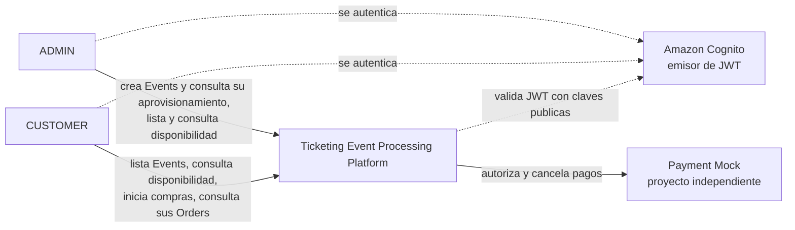

Actores autónomos internos: consumidor de Orders, proceso de expiración (§4 de la especificación) y, por esta revisión, consumidor de aprovisionamiento, barrido de republicación, proceso de reversos y limpieza de aprovisionamiento.

## 4. Containers

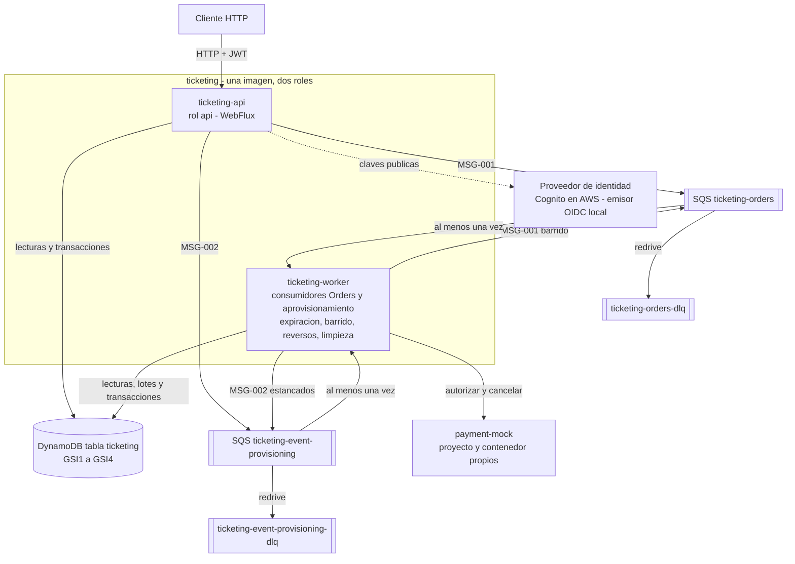

Topología local: ADR-036. Topología objetivo: `ticketing.aws-target.v2.md`.

## 5. Components

| ID | Component | Layer | Responsibility | Source IDs |
|---|---|---|---|---|
| CMP-001 | HTTP API entrypoint | Infrastructure (entrada) | Exponer `API-001` a `API-006`; validar sintaxis; extraer identidad; traducir a comandos | TC-003, TC-008, FR-001, FR-002, FR-006, FR-009, FR-012 |
| CMP-002 | Security configuration | Infrastructure | Resource Server; mapeo de `cognito:groups`; autorización por rol, incluida `API-006` solo `ADMIN` | FR-018, FR-019, TC-016, AC-028, AV-005 |
| CMP-003 | Event management use case | Use Cases | Idempotencia de creación; validar definición compacta; crear Event en `PROVISIONING`; publicar `MSG-002`; consultar estado de aprovisionamiento | FR-001, FR-003, FR-017, BR-016, BR-021, VAL-006 a VAL-009, AC-001, AC-017, FG-002, AV-002 |
| CMP-004 | Event catalog and availability use cases | Use Cases | Listar Events `ENABLED` futuros con `soldOut`; página de disponibles por cursor y sección; recuento cacheado | FR-002, FR-012, BR-012, BR-018, BR-022, AC-002, AC-010, AV-001 |
| CMP-005 | Purchase initiation use case | Use Cases | Idempotencia; validaciones previas; reserva con bloqueo; publicación con presupuesto; compensación; republicación en repetición | FR-004, FR-005, FR-006, FR-010, FR-016, FR-017, AC-003, AC-004, AC-016, AC-022, FG-001, FG-004, FG-005 |
| CMP-006 | Order query use case | Use Cases | Order propia leída del item Order con lectura fuerte; inexistente y ajena iguales | FR-009, BR-023, VAL-011, AC-006, AC-027 |
| CMP-007 | Order processing use case | Use Cases | Reglas de consumo; pago; cierre con bloqueo y marca de reverso; aprobación tardía; cuarentena | FR-007, FR-008, FR-015, FR-017, AC-005, AC-019 a AC-025, FG-003 |
| CMP-008 | Reservation expiration use case | Use Cases | Expirar Reservation vencidas con marca de reverso; cuarentena ante inconsistencia | FR-011, VAL-003, AC-008, AC-009 |
| CMP-009 | Domain model | Domain | Entidades, máquinas de estado, invariantes; reglas de una Order activa, cuarentena, reverso, ciclo de aprovisionamiento; generación de `ticketId` y shards; errores | DS-001 a DS-010, ST-001 a ST-010, BR-001 a BR-023 |
| CMP-010 | DynamoDB persistence adapter | Infrastructure (salida) | Access patterns y transacciones de `ticketing.data-model.v2.md`; motivos por item; lotes; recuento por shards | TC-004, TC-011, NFR-006, FR-013, FR-014 |
| CMP-011 | SQS publisher adapter | Infrastructure (salida) | Publicar `MSG-001` y `MSG-002` con timeout, circuit breaker y retry | TC-005, FR-005, FR-001 |
| CMP-012 | SQS Orders consumer adapter | Infrastructure (entrada) | Bucle reactivo de Orders con pausa por el circuito del Payment Mock | TC-005, TC-010, FR-007, NFR-003 |
| CMP-013 | Payment gateway adapter | Infrastructure (salida) | Autorizar y cancelar con idempotencia, clasificación de resultados y circuit breaker | FR-015, TC-017, BR-020, FG-003 |
| CMP-014 | Periodic scheduler adapter | Infrastructure (entrada) | Disparadores independientes para `CMP-008`, `CMP-015`, `CMP-023`, `CMP-024` | FR-011, NFR-003 |
| CMP-015 | Provisioning cleanup use case | Use Cases | Detectar Events estancados (republicar o `FAILED`); purgar Ticket de Events `FAILED` | FR-001, FR-003 |
| CMP-016 | Error translation | Infrastructure (entrada) | Problem Details con mapeo exhaustivo y precedencia | TC-009, ERR-002, ERR-006, ERR-009 |
| CMP-017 | Request guard | Infrastructure (entrada) | Límite de cuerpo de 256 KB; limitación por sujeto | NFR-010, EVAL-008 |
| CMP-018 | Observability | Infrastructure (transversal) | Logs, métricas técnicas y de negocio, trazas; puerto de gestión interno | NFR-005, EVAL-013 |
| CMP-019 | Payment Mock service | Proyecto independiente | Autorización determinista e idempotente; cancelación con registro anticipado; API de control | TC-017, FR-015, AC-019 a AC-021, FG-003, AV-004 |
| CMP-020 | Local identity provider | Servicio local | JWT de forma Cognito para sujetos arbitrarios e identidades deterministas | TC-016, TC-012 |
| CMP-021 | Bootstrap and configuration | Infrastructure | Composición, roles, configuración por entorno | TC-002, TC-007, TC-012 |
| CMP-022 | Event provisioning use case | Use Cases | Lease, lotes con comprobación previa, verificación, habilitación o `FAILED` | FR-001, FR-003, BR-016, BR-021, VAL-009, FG-002 |
| CMP-023 | Enqueue republish sweep use case | Use Cases | Republicar Orders en `CREATED` sin `enqueuedAt` de más de 30 s | FR-005, ALT-006, AC-022 |
| CMP-024 | Payment reversal use case | Use Cases | Cancelar pagos marcados, reprogramar, completar o agotar | FR-015, BR-003, FG-003 |
| CMP-025 | SQS provisioning consumer adapter | Infrastructure (entrada) | Bucle reactivo de aprovisionamiento con heartbeat de visibilidad | TC-005, TC-010, FR-001 |
| CMP-026 | Resilience policies | Infrastructure (transversal) | Circuit breakers por dependencia, métricas de estado y eventos de pausa y reanudación | TC-009, EVAL-005 |

## 6. Ports

| Port | Direction | Purpose | Implemented by |
|---|---|---|---|
| Create Event | Entrada | Crear un Event en `PROVISIONING` | CMP-003 |
| Get Event provisioning status | Entrada | Estado de aprovisionamiento (`ADMIN`) | CMP-003 |
| List Events | Entrada | Events `ENABLED` futuros | CMP-004 |
| Get Event availability | Entrada | Recuento y página de disponibles | CMP-004 |
| Start purchase | Entrada | Iniciar compra | CMP-005 |
| Get Order | Entrada | Consultar Order propia | CMP-006 |
| Process Order | Entrada | Procesar `MSG-001` | CMP-007 |
| Provision Event | Entrada | Procesar `MSG-002` | CMP-022 |
| Expire Reservations | Entrada | Ciclo de expiración | CMP-008 |
| Republish pending Orders | Entrada | Ciclo de barrido | CMP-023 |
| Reverse payments | Entrada | Ciclo de reversos | CMP-024 |
| Clean up provisioning | Entrada | Ciclo de limpieza y estancados | CMP-015 |
| Event catalog | Salida | Crear con idempotencia, obtener, listar, lease y progreso, habilitar, `FAILED`, estancados, republicación, purga | CMP-010 |
| Ticket inventory | Salida | Lote, verificación, purga, página de disponibles, recuento, sondeo | CMP-010 |
| Order lifecycle store | Salida | Transiciones de ADR-025 con bloqueo, cuarentena, reverso, aprobación tardía; marcar `enqueuedAt` | CMP-010 |
| Order reader | Salida | Order por ID; vencidas; pendientes de encolado; reversos pendientes | CMP-010 |
| Idempotency store | Salida | Registros de compra y de creación de Event | CMP-010 |
| Order queue publisher | Salida | `MSG-001` | CMP-011 |
| Provisioning queue publisher | Salida | `MSG-002` | CMP-011 |
| Payment gateway | Salida | Autorizar y cancelar; resultado tipado incluido "dependencia no disponible" | CMP-013 |
| Clock | Salida | Instante actual | CMP-021 |
| Id generator | Salida | Identificadores | CMP-021 |

Dirección de dependencias y reglas de frontera: ADR-034. Retry y circuit breaker solo en adaptadores (ADR-035).

## 7. Critical flows

Convenciones: `AP-*` en `ticketing.data-model.v2.md`; `MSG-*` en `ticketing.messaging.v2.md`; transiciones en §8.

### 7.1 Purchase — happy path

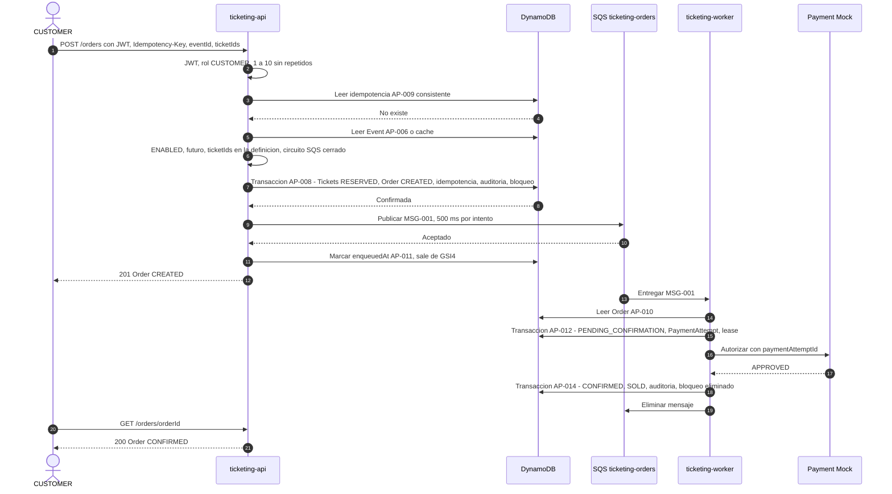

Decisiones: ADR-023, ADR-025, ADR-026, ADR-027, ADR-032.

### 7.2 Purchase — ticket unavailable and active Order exists

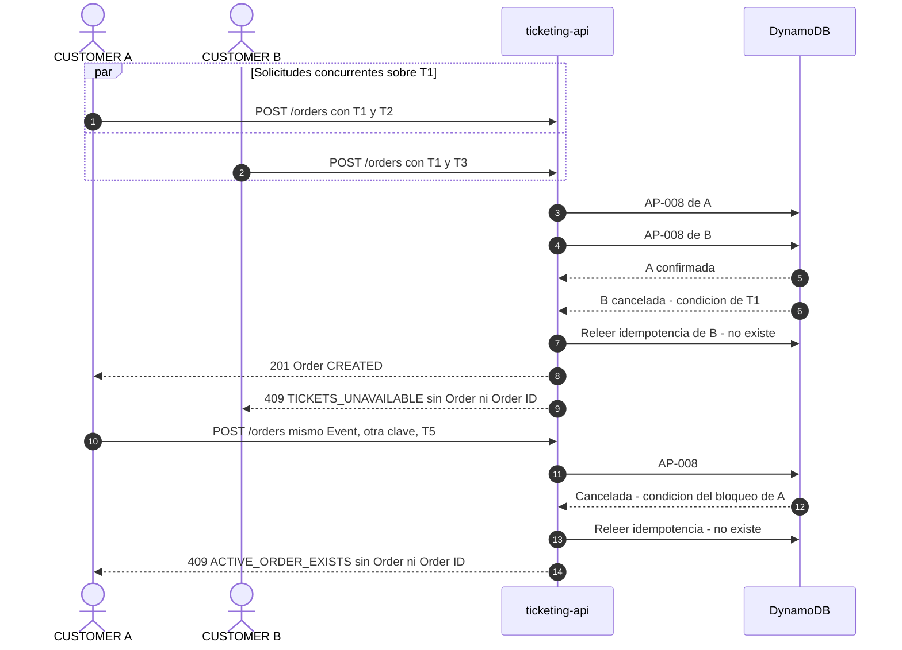

Conflicto transaccional en lugar de fallo de condición: hasta 2 reintentos con jitter; si persiste, 503. Ningún rechazo persiste nada (`HC-001`, `FG-004`). Decisiones: ADR-023, ADR-032, ADR-035.

### 7.3 Purchase — payment rejected

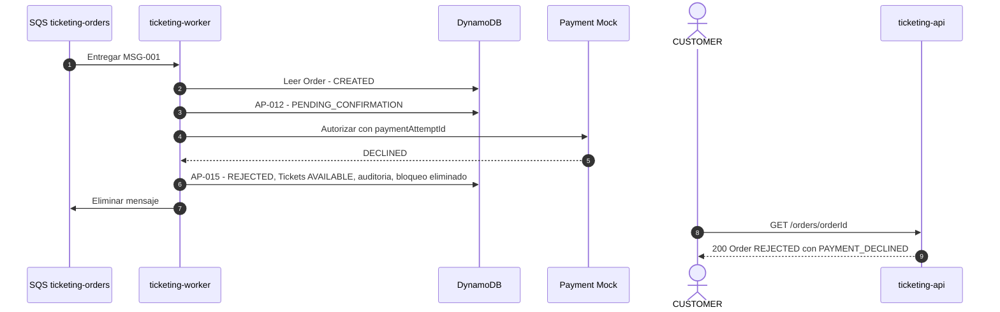

Variante técnica: transitorios con backoff por visibilidad; en la quinta recepción, `FAILED` (`PROCESSING_FAILED`) con marca de reverso porque el resultado es desconocido (ADR-029, `FG-003`).

### 7.4 Purchase — enqueue failure, open circuit and republish sweep

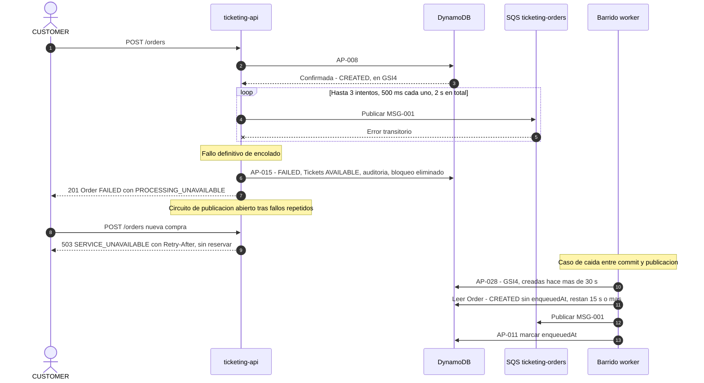

Doble fallo (publicación y compensación): 503 sin Order ID; el barrido la republica; en último término expira. Decisiones: ADR-026, ADR-035.

### 7.5 Duplicate message

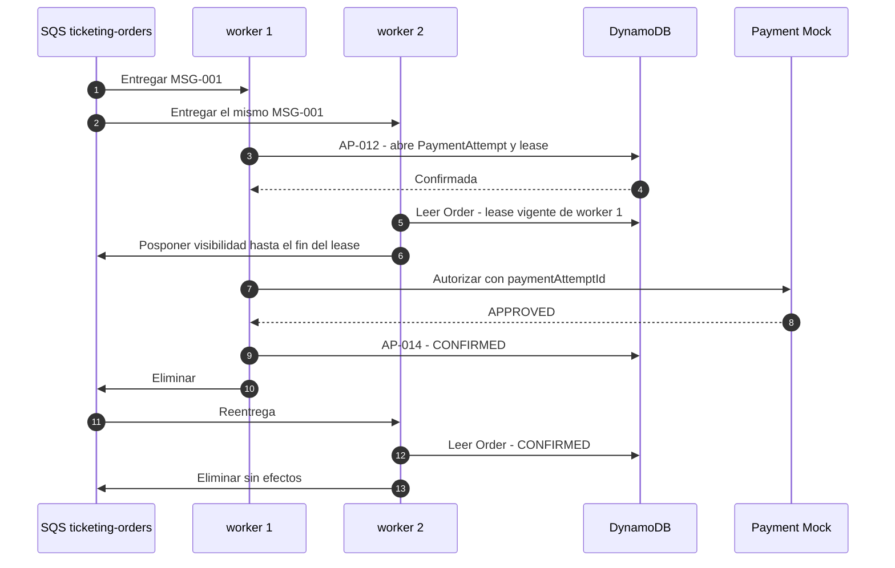

Lease vencido tras caída: otro consumidor reclama (AP-013) y reanuda el mismo PaymentAttempt; el mock es idempotente. Decisiones: ADR-027, ADR-029.

### 7.6 Reservation expiration

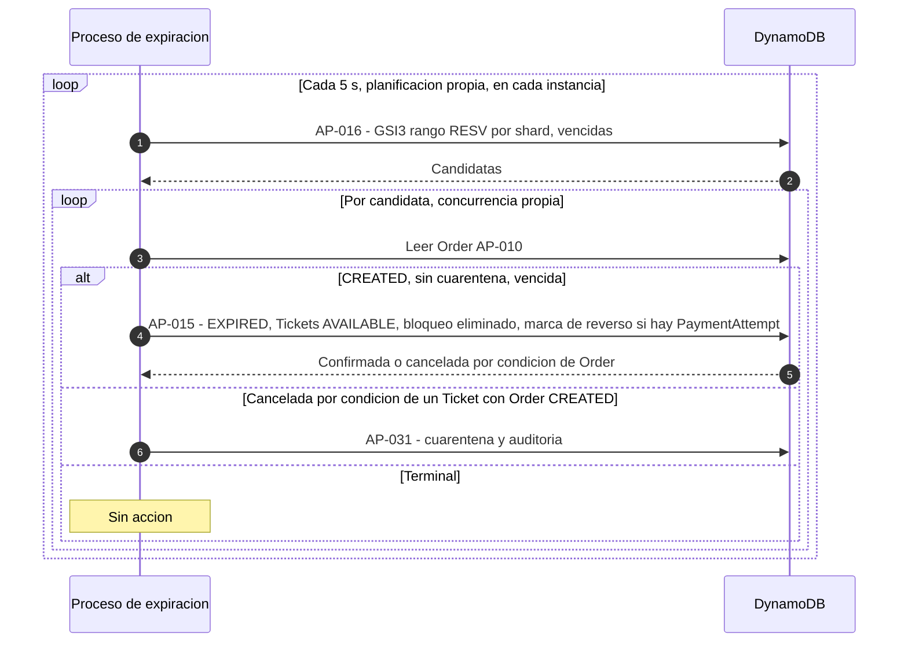

Demora máxima 15 s tras `expiresAt` (`AV-003`). Decisiones: ADR-028, ADR-025.

### 7.7 Payment versus expiration race

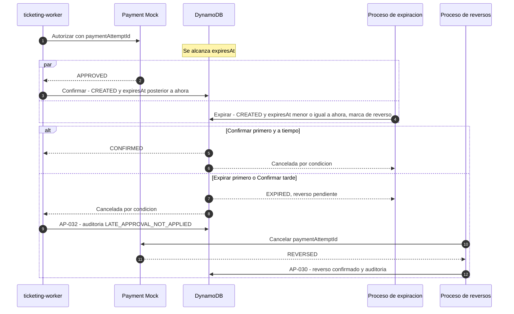

Decisiones: ADR-008, ADR-025, ADR-030.

### 7.8 Event creation and asynchronous provisioning

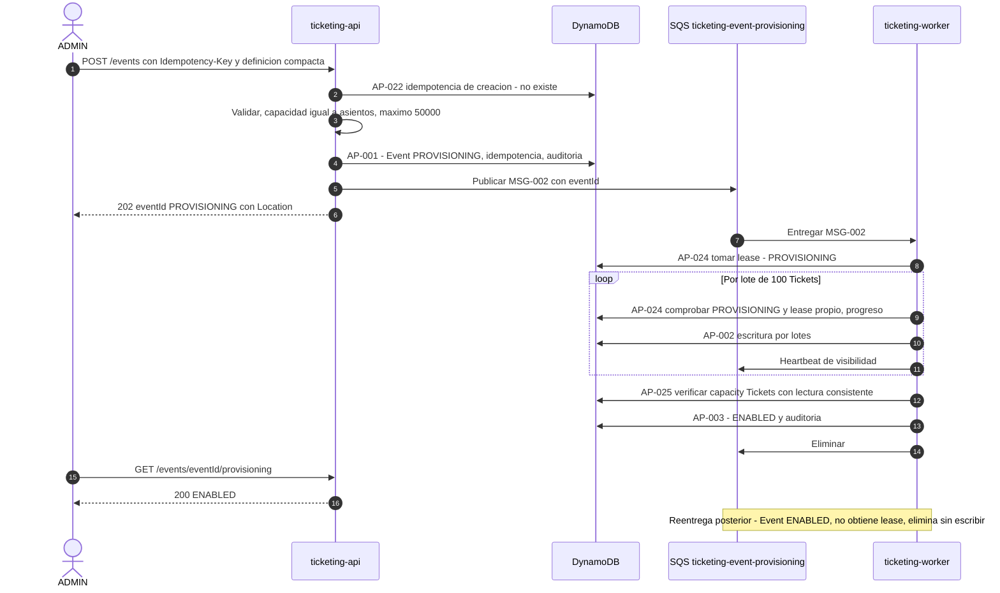

Fallo definitivo: `FAILED` en la quinta recepción o por la detección de estancados; la limpieza purga los Ticket. Decisiones: ADR-024, ADR-027, ADR-029.

### 7.9 Payment reversal with early cancellation

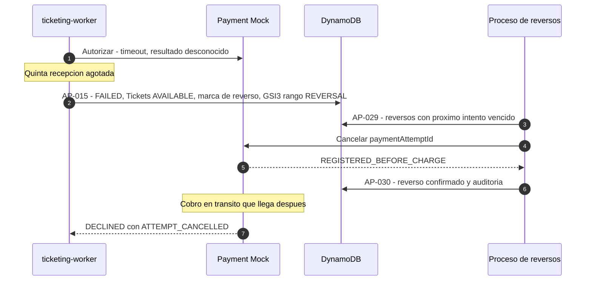

Agotamiento tras 10 intentos: rango `REVERSAL#EXHAUSTED`, auditoría y alarma. Decisiones: ADR-025, ADR-030, ADR-031.

### 7.10 Same Idempotency-Key race

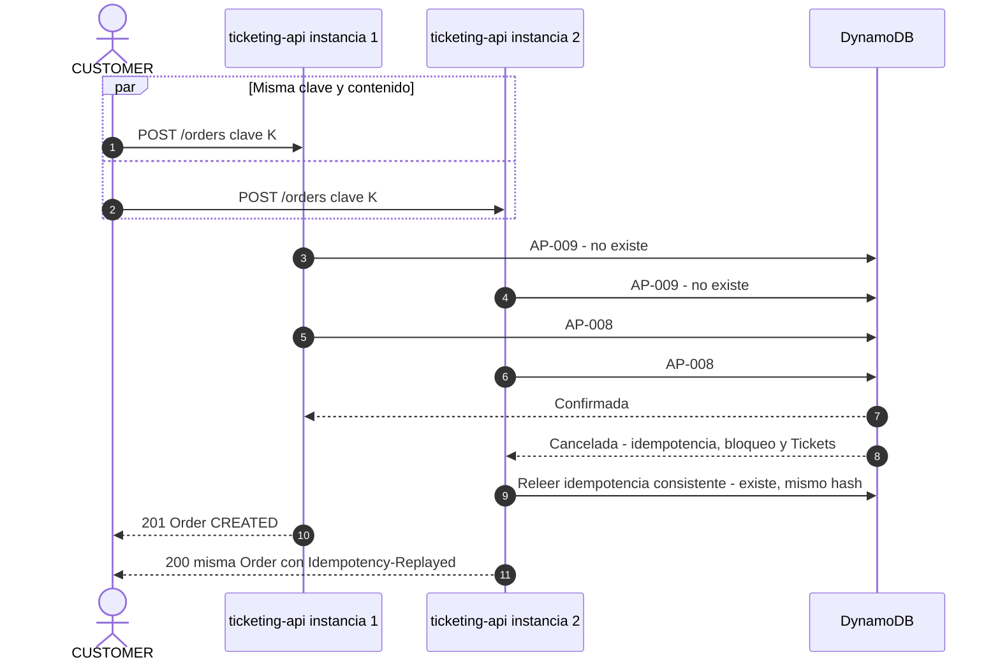

Contenido distinto: la perdedora recibe 422 `IDEMPOTENCY_KEY_REUSED`. Decisión: ADR-027.

### 7.11 Payment Mock outage and circuit breaker

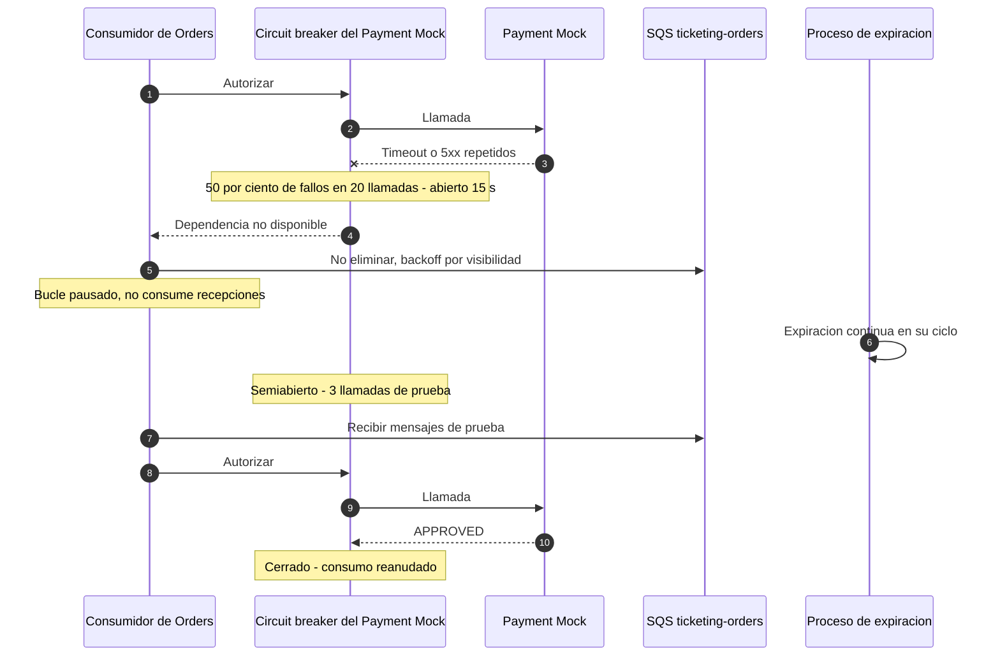

Decisiones: ADR-035, ADR-039, ADR-028.

## 8. State transition implementation

Cada fila es una única escritura transaccional. `N` = Ticket de la Order (1..10). Detalle de condiciones: `ticketing.data-model.v2.md` §5.

| ST ID | Writes performed together | Guard conditions | Items máx. | ADR |
|---|---|---|---|---|
| ST-001 + ST-006 | N Ticket `AVAILABLE` → `RESERVED` (salen de `GSI2`); Order `CREATED` con Reservation en `GSI3` `RESV#` y `GSI4`; idempotencia; auditoría; bloqueo de Order activa | Ticket existe, pertenece al Event y está `AVAILABLE`; Order, idempotencia, auditoría y bloqueo no existen | 14 | ADR-023, ADR-025, ADR-027, ADR-032 |
| ST-003 | Order con PaymentAttempt y lease; N Ticket `RESERVED` → `PENDING_CONFIRMATION`; auditoría | Order `CREATED`, sin PaymentAttempt, sin cuarentena, `expiresAt > ahora + 15 s`; Ticket `RESERVED` y de esta Order | 12 | ADR-025, ADR-027, ADR-008 |
| ST-004 + ST-007 | Order → `CONFIRMED`; N Ticket → `SOLD`; auditoría; bloqueo eliminado | Order `CREATED`, sin cuarentena, PaymentAttempt coincide, `expiresAt > ahora`; Ticket `PENDING_CONFIRMATION` y de esta Order | 13 | ADR-025, ADR-008 |
| ST-005 + ST-008 | Order → `REJECTED`; N Ticket → `AVAILABLE`; auditoría; bloqueo eliminado | Order `CREATED`, sin cuarentena, PaymentAttempt coincide; Ticket `RESERVED` o `PENDING_CONFIRMATION` y de esta Order | 13 | ADR-025 |
| ST-005 + ST-009 (procesamiento) | Order → `FAILED`; marca de reverso si el resultado es desconocido; N Ticket → `AVAILABLE`; auditoría; bloqueo eliminado | Order `CREATED`, sin cuarentena, identidad del PaymentAttempt igual a la leída; Ticket como arriba | 13 | ADR-025, ADR-029 |
| ST-005 + ST-009 (encolado) | Order → `FAILED`; N Ticket → `AVAILABLE`; auditoría; bloqueo eliminado | Order `CREATED` y sin PaymentAttempt; Ticket como arriba | 13 | ADR-025, ADR-026 |
| ST-002 + ST-010 | Order → `EXPIRED`; marca de reverso si tiene PaymentAttempt; N Ticket → `AVAILABLE`; auditoría; bloqueo eliminado | Order `CREATED`, sin cuarentena, `expiresAt <= ahora`; Ticket como arriba | 13 | ADR-025, ADR-008, ADR-028 |

Escrituras técnicas que no son transiciones de negocio (no cambian estados de Ticket ni de Order): cuarentena (AP-031), aprobación tardía (AP-032), reverso (AP-030), `enqueuedAt` (AP-011), lease (AP-013). `COMPLIMENTARY` solo se escribe en el aprovisionamiento (ADR-024). `SOLD` y `COMPLIMENTARY` no son origen de ninguna transición.

**Observación de consolidación (no es una contradicción).** La respuesta humana a ADR-005 indica "ninguna transición supera 13 items" con el conjunto de items de la versión 1. La respuesta humana a ADR-013, que remite expresamente a ADR-005, añade el bloqueo de Order activa a la reserva, que pasa a 14 items. Se interpreta la cifra como cota derivada cuyo propósito (caber holgadamente en el límite de `TransactWriteItems`, `TO_VERIFY`, se asumen 100) se conserva; no se altera ninguna regla normativa ni el máximo de ADR-003. Detalle en ADR-025.

## 9. Decision register

Estados según `architecture/adr/ticketing.adr-registry.v1.md`.

| ADR | Title | Status | Priority | Source IDs |
|---|---|---|---|---|
| [ADR-003](adr/ADR-003-tickets-per-order-limit.md) | Tickets per Order limit | ACCEPTED | HIGH | TC-011, FR-004, BR-014 |
| [ADR-008](adr/ADR-008-payment-versus-expiration-race.md) | Payment versus expiration race | ACCEPTED | HIGH | ST-002, ST-004, ST-010, AC-008, AC-019 |
| [ADR-022](adr/ADR-022-dynamodb-data-model-ticket-partitioning.md) | DynamoDB data model with per-Ticket partitioning and sharded indexes | ACCEPTED (supersedes ADR-001) | HIGH | TC-004, NFR-006, FR-003, FR-012 |
| [ADR-023](adr/ADR-023-atomic-multi-ticket-reservation-cross-partition.md) | Atomic multi-ticket reservation across partitions | ACCEPTED (supersedes ADR-002) | HIGH | TC-011, ST-001, FR-004, FR-010, VAL-010, AC-004, AC-007, AC-016 |
| [ADR-024](adr/ADR-024-asynchronous-event-provisioning.md) | Asynchronous Event provisioning at capacity scale | ACCEPTED (supersedes ADR-004) | MEDIUM | FR-001, BR-021, VAL-009, AC-001, AC-017 |
| [ADR-025](adr/ADR-025-state-transition-consistency-quarantine-reversal.md) | State transition consistency with quarantine and reversal marking | ACCEPTED (supersedes ADR-005) | HIGH | FR-008, FR-013, ST-001 a ST-010 |
| [ADR-026](adr/ADR-026-persistence-plus-enqueue-with-republish-sweep.md) | Persistence plus enqueue with publish budget and republish sweep | ACCEPTED (supersedes ADR-006) | HIGH | FR-005, FR-006, ALT-006, ERR-007, AC-003, AC-022 |
| [ADR-027](adr/ADR-027-idempotency-purchase-event-creation.md) | Idempotency for purchases, Event creation, messages and payments | ACCEPTED (supersedes ADR-007) | HIGH | FR-017, BR-019, BR-020, NFR-015, AC-023, AC-024, AC-025 |
| [ADR-028](adr/ADR-028-expiration-process-isolated-scheduling.md) | Expiration process with isolated scheduling | ACCEPTED (supersedes ADR-009) | HIGH | FR-011, VAL-003, AC-008, AC-009 |
| [ADR-029](adr/ADR-029-sqs-operational-policy-orders-and-provisioning.md) | SQS operational policy for both queues | ACCEPTED (supersedes ADR-010) | HIGH | TC-005, TC-009, TC-010, ALT-004, ERR-004, ERR-005 |
| [ADR-030](adr/ADR-030-payment-mock-independent-project-with-cancellation.md) | Payment Mock as independent project with cancellation | ACCEPTED (supersedes ADR-011) | MEDIUM | TC-017, FR-015, AC-019, AC-020, AC-021 |
| [ADR-031](adr/ADR-031-audit-trail-extended-catalog.md) | Audit trail with extended catalog | ACCEPTED (supersedes ADR-012) | MEDIUM | FR-014, BR-010, NFR-005, AC-015 |
| [ADR-032](adr/ADR-032-security-active-order-lock.md) | Security including one active Order per customer and Event | ACCEPTED (supersedes ADR-013) | HIGH | FR-018, FR-019, BR-023, VAL-011, NFR-010, TC-016, AC-027, AC-028, EVAL-006 a EVAL-008 |
| [ADR-033](adr/ADR-033-local-identity-provider-load-identities.md) | Local identity provider with load and deterministic identities | ACCEPTED (supersedes ADR-014) | MEDIUM | TC-016, TC-012 |
| [ADR-034](adr/ADR-034-clean-architecture-structure-independent-mock.md) | Clean Architecture with independent Payment Mock | ACCEPTED (supersedes ADR-015) | HIGH | TC-007, TC-013, TC-015, NFR-012, DEL-001 |
| [ADR-035](adr/ADR-035-error-model-reactive-retry-circuit-breaker.md) | Error model, reactive retry and circuit breakers | ACCEPTED (supersedes ADR-016) | MEDIUM | TC-008, TC-009, NFR-003 |
| [ADR-036](adr/ADR-036-local-topology-v2.md) | Local topology v2 | ACCEPTED (supersedes ADR-017) | LOW | TC-006, TC-012, DEL-005 |
| [ADR-037](adr/ADR-037-aws-target-topology-v2.md) | AWS target topology v2 | ACCEPTED (supersedes ADR-018) | MEDIUM | EVAL-005, EVAL-011, EVAL-012, EVAL-013 |
| [ADR-038](adr/ADR-038-test-strategy-v2.md) | Test strategy v2 | ACCEPTED (supersedes ADR-019) | MEDIUM | NFR-013, TC-014, DEL-003, AC-007, AC-029 a AC-031 |
| [ADR-039](adr/ADR-039-aws-integration-technology-v2.md) | AWS integration technology v2 | ACCEPTED (supersedes ADR-020) | MEDIUM | TC-003, TC-004, TC-005, NFR-003 |
| [ADR-040](adr/ADR-040-availability-read-model-sharded-paginated.md) | Availability read model, sharded and paginated | ACCEPTED (supersedes ADR-021) | MEDIUM | FR-002, FR-003, FR-012, BR-012, AC-002, AC-010, AC-030 |

Temas obligatorios con ADR `ACCEPTED`: A → ADR-022 (y ADR-040); B → ADR-023; C → ADR-003; D → ADR-024; E → ADR-025; F → ADR-026; G → ADR-027; H → ADR-008; I → ADR-028; J → ADR-029; K → ADR-030; L → ADR-031; M → ADR-032; N → ADR-033; O → ADR-034; P → ADR-035; Q → ADR-036; R → ADR-037; S → ADR-038. Adicionales: ADR-039, ADR-040.

## 10. Local topology

Decisión completa en ADR-036.

| Servicio | Propósito | Arranca después de |
|---|---|---|
| `dynamodb-local` | Persistencia | — |
| `localstack` (tag fijado) | Cuatro colas SQS | — |
| `local-idp` | JWT con sujetos arbitrarios | — |
| `payment-mock` | Payment Mock desde su propio build | — |
| `infra-init` | Tabla con `GSI1` a `GSI4`, TTL, cuatro colas y redrive | `dynamodb-local`, `localstack` saludables |
| `ticketing-api` | Rol `api` | `infra-init` completado, `local-idp` saludable |
| `ticketing-worker` | Rol `worker` | `infra-init` completado, `payment-mock` saludable |
| `load-token-generator` (perfil) | Más de 1.000 tokens `CUSTOMER` | `local-idp` saludable |
| `load-test` (perfil) | Prueba de carga | `ticketing-api` saludable, `load-token-generator` completado |

No se define el archivo de Docker Compose.

## 11. Test strategy

Decisión completa en ADR-038.

| Tema | Decisión |
|---|---|
| Cobertura (`NFR-013`, `AV-006`) | ≥ 90 % de líneas agregada sobre `domain`, `application`, `infrastructure` de `ticketing`, solo pruebas sin contenedores; `payment-mock` fuera |
| Herramientas (`TC-014`) | JUnit 5, Mockito, reactor-test |
| Concurrencia (`AC-007`) | Invariante con solicitudes simultáneas; doble en memoria y DynamoDB Local |
| Mecanismos nuevos | Carrera de misma clave; reentrega de aprovisionamiento; cancelación anticipada; barrido frente a ruta síncrona; una Order activa; circuit breaker con tiempo virtual; cuarentena |
| Carga (`AC-029` a `AC-031`) | Event de 50.000 Ticket; escenario concentrado > 1.000 usuarios; > 1.000 identidades; invariantes ampliadas |
| Resiliencia | Worker detenido a mitad de pago; Payment Mock detenido; cola detenida (README) |

Resultados válidos para el entorno medido; objetivos de prueba, no capacidad productiva.

## 12. Risks

| ID | Risk | Impact | Mitigation | Related ADR |
|---|---|---|---|---|
| RISK-001 | Partición caliente por Event popular | Throttling en el Event más demandado | Ticket con partition key propia; shards en `GSI2` (hasta 32), `GSI3`, `GSI4`; on-demand; precalentamiento productivo | ADR-022, ADR-037 |
| RISK-002 | Conflictos transaccionales sobre los mismos Ticket | Latencia o 503 | Transacciones ≤ 14 items, reintento acotado con jitter, métrica | ADR-023, ADR-025 |
| RISK-003 | Order en `CREATED` sin mensaje | Procesamiento retrasado | Barrido a los 30 s, republicación en repetición, expiración | ADR-026 |
| RISK-004 | Pago aprobado o desconocido sin compra | Cobro sin compra | Margen de corte, guarda temporal, marca de reverso, cancelación con registro anticipado | ADR-008, ADR-025, ADR-030 |
| RISK-005 | Demora de expiración superior a 15 s | Ticket retenidos | Ciclo aislado cada 5 s, dos instancias mínimas, alarma | ADR-028 |
| RISK-006 | Desalineación de relojes | Guardas desplazadas segundos | Sincronización horaria, márgenes | ADR-008, ADR-028 |
| RISK-007 | Emuladores distintos de los servicios | Comportamiento distinto en AWS | Verificación temprana; pruebas contra AWS | ADR-036, ADR-038 |
| RISK-008 | Entorno local no alcanza la carga | AC-029 a AC-031 no demostrables en local | Repetición en AWS con su entorno | ADR-038 |
| RISK-009 | Coste y latencia de la disponibilidad | AC-030 en riesgo | Página acotada, recuento cacheado y compartido | ADR-040 |
| RISK-010 | Acaparamiento de inventario | Denegación a otros clientes | Máximo por Order, una Order activa por cliente y Event, tasa, control de bots, expiración | ADR-003, ADR-032, ADR-037 |
| RISK-011 | Aprovisionamiento interrumpido | Event no habilitado | Reanudación, detección de estancados, `FAILED`, purga | ADR-024 |
| RISK-012 | Compatibilidad de librerías con Java 25 y Spring Boot 4.x | Bloqueo o cambio de herramienta | Verificación al inicio; alternativas definidas | ADR-034, ADR-035, ADR-038, ADR-039 |
| RISK-013 | Token local distinto del de Cognito | Autorización distinta en AWS | Prueba de contrato de claims; perfil con user pool real | ADR-033 |
| RISK-014 | DLQ sin atender; doble fallo cerrado como `EXPIRED` | Diagnóstico tardío | Alarmas de ambas DLQ; redrive inocuo | ADR-029 |
| RISK-015 | Auditoría en la tabla operativa | Crecimiento; inmutabilidad por convención | PITR; mejora productiva con bloqueo de objetos | ADR-031 |
| RISK-016 | Worker pausado más allá del lease escribe un lote tras la habilitación | Sobrescritura de un Ticket ya vendido o reservado | Lease de 60 s frente a lotes de milisegundos; comprobación antes de cada lote; habilitación con lease propio; prueba de reentrega; riesgo residual declarado | ADR-024 |
| RISK-017 | Estado del circuito por instancia; 503 en masa con SQS degradado | Rechazos de compra | Ventanas cortas, apertura breve, alarmas; repetición con la misma clave | ADR-035 |
| RISK-018 | Orders en cuarentena retienen Ticket y bloqueo | Inventario y cliente bloqueados hasta revisión | Alarma, rango `REVIEW#QUARANTINE`, revisión manual, invariantes | ADR-025, ADR-032 |
| RISK-019 | Recuento costoso con muchos shards o caché ineficaz con muchas instancias | Coste y latencia | Límite de 32 shards, caché 1 s, consulta compartida, métrica | ADR-040 |
| RISK-020 | Reverso agotado | Cobro sin compra pendiente de revisión manual | Backoff largo, alarma, rango `REVERSAL#EXHAUSTED` | ADR-025 |
| RISK-021 | El tag fijado de LocalStack no ofrece lo requerido | Entorno local incompleto | Token gratuito no versionado o ElasticMQ con revisión funcional | ADR-036 |
| RISK-022 | Duplicado de Event tras vencer la clave de creación | Event duplicado vendible | Vigencia 24 h documentada; consulta de estado antes de repetir | ADR-027 |
| RISK-023 | Sondeo de agotados recorre todos los shards de un Event agotado | Coste del listado | Parada en el primer resultado; listado paginado | ADR-022, ADR-040 |
| RISK-024 | Autoescalado del worker sin efecto durante una caída del Payment Mock | Coste | Máximo de tareas; consumo pausado | ADR-029, ADR-037 |
| RISK-025 | Duplicados y escrituras de índice del barrido | Coste y mensajes extra | Consumidor idempotente; índice KEYS_ONLY con sharding | ADR-026 |

## 13. Items to verify

Consolidado de todos los ADR vigentes. Ninguno se afirma de memoria; cada uno se comprueba al inicio del desarrollo.

| # | Item | What to verify | Design impact if different |
|---|---|---|---|
| 1 | `TransactWriteItems` | Máximo de items y tamaño (se asumen 100 items) | 14 cabe; un aumento del máximo de ADR-003 exige reverificar |
| 2 | Motivos de cancelación por item | Solicitud del item que falló la condición en SDK, servicio y DynamoDB Local | Lectura de respaldo para clasificar |
| 3 | Aislamiento transaccional multi-partición | Serialización frente a escrituras simples y transaccionales; fidelidad de DynamoDB Local | Base del guardián único; si falla, revisar diseño; pruebas contra AWS |
| 4 | Escritura por lotes | 25 items por solicitud, items no procesados | Número de solicitudes por lote |
| 5 | Lectura por lotes consistente | 100 claves por solicitud; soporte en DynamoDB Local | Lecturas individuales en local |
| 6 | Throughput por partición de tabla y GSI | Límites vigentes | Divisor de `availabilityShards` y shards de `GSI3`/`GSI4` |
| 7 | Escritura de GSI en actualizaciones sin cambio de claves o proyección | Facturación | Solo coste |
| 8 | Límites de tabla | 20 GSIs por tabla, 400 KB por item | Límites de la definición compacta |
| 9 | Recuento con solo cantidad | Paginación por tamaño leído y coste | Concurrencia del recuento |
| 10 | TTL | Demora de borrado y soporte en DynamoDB Local | Ninguno funcional |
| 11 | GSI disperso en DynamoDB Local | Retirada del item al eliminar el atributo de clave | Más candidatas obsoletas; sin impacto en corrección |
| 12 | Aprovisionamiento de 50.000 Ticket | Duración en DynamoDB Local y en AWS | Paralelismo y tamaño de lote |
| 13 | Latencia de disponibilidad con 50.000 Ticket | p95 bajo la carga objetivo | Shards, página o caché |
| 14 | Límites de SQS | Long polling, mensajes por recepción, visibilidad máxima, retención | Parámetros de ADR-029 |
| 15 | LocalStack fijado a un tag anterior al 23-03-2026 | Arranque sin token; SQS Standard; redrive; contador de recepciones; cambio de visibilidad | Token gratuito no versionado o ElasticMQ con revisión de `HV-010` |
| 16 | Timeout de publicación de 500 ms | Latencia real de SQS y LocalStack | Valor configurable |
| 17 | Clasificación de errores del cliente SQS | Reintentables y no reintentables | Clasificación de ADR-035 |
| 18 | Resilience4j y módulo de Reactor | Compatibilidad con Spring Boot 4.x y Java 25 | Circuito mínimo propio |
| 19 | SDK oficial de AWS con Java 25 | Versión, cliente HTTP asíncrono, retry por defecto | Si no es compatible, conflicto con el stack obligatorio y escalado |
| 20 | Spring Boot 4.x | Resource Server reactivo, Problem Details, límite de cuerpo en memoria, puerto de gestión separado, apagado ordenado, cliente HTTP reactivo, exportación de métricas y trazas | Solo implementación |
| 21 | Token de acceso de Cognito | Grupos, tipo, cliente, sujeto, ausencia de audiencia | Validadores |
| 22 | Emisor OIDC local | Sujetos y claims arbitrarios, vigencia, descubrimiento, emisor coherente host/red, emisión de > 1.000 tokens | Servidor de identidad completo o generador propio |
| 23 | Build e imagen base | Multi-proyecto con Java 25 y plugin de Spring Boot 4.x; imagen de Java 25 | Cambia herramienta o imagen |
| 24 | Herramientas de prueba | Cobertura, Mockito, detector de bloqueo, pruebas de arquitectura, contenedores de prueba con Java 25 | Si la cobertura no es compatible, `NFR-013` se escala |
| 25 | Herramienta de carga y capacidad local | Tasa constante, percentiles; 200 solicitudes/s en local | Ejecutar en AWS |
| 26 | Limitación por tasa | Librería compatible | Componente propio |
| 27 | AWS: plataforma | Endpoint privado de Cognito; métricas de autoescalado por pendientes y antigüedad; control de bots del WAF; tiempo máximo de parada de Fargate; sincronización horaria | Salida a Internet; escalado por pasos; reglas por tasa; márgenes |
| 28 | Warm throughput de DynamoDB | Configuración vigente para tabla e índices | Solo mejora productiva |
| 29 | Captura de cambios a almacenamiento con bloqueo de objetos | Mecanismo vigente | Solo mejora productiva |
| 30 | Tarifas | DynamoDB transaccional y GSIs, WAF, endpoints, cómputo | Solo estimación |

## 14. Functional gaps and architecture validations

Todos resueltos por la revisión humana y aplicados. Las que cambian comportamiento observable están en `ticketing.functional-clarifications.v1.md`.

| ID | Question | Human answer applied | Priority | Affected items |
|---|---|---|---|---|
| FG-001 | Máximo de Ticket por Order | CONFIRMED: 1 a 10, mismo Event, sin repetidos; rechazo previo sin efectos | HIGH | ADR-003, ADR-023, ADR-025, API-004, AP-008 |
| FG-002 | Capacidad máxima de un Event | CONFIRMED_WITH_CHANGE: 50.000; rechazo completo; lotes en aprovisionamiento; habilitación verificada; disponibilidad paginada | HIGH | ADR-022, ADR-024, ADR-040, API-001, API-003, AP-002, AP-020, AP-025 |
| FG-003 | Pago aprobado o desconocido sin compra | CONFIRMED_WITH_CHANGE: Order terminal, Ticket liberados, marca de reverso, cancelación idempotente con registro anticipado, agotamiento a revisión manual | HIGH | ADR-008, ADR-025, ADR-028, ADR-030, ADR-031, CMP-024, AP-029, AP-030, AP-032, API-102 |
| FG-004 | Repetición de una solicitud rechazada | CONFIRMED: se reevalúa; rechazos no persistidos | HIGH | ADR-027, ADR-023, ADR-035, AP-009 |
| FG-005 | Compra sobre un Event pasado | CONFIRMED_WITH_CHANGE: `EVENT_NOT_ON_SALE` 409 antes de la transacción; disponibilidad responde; confirmación sin guarda de `startsAt` | HIGH | ADR-023, ADR-035, ADR-040, API-003, API-004 |
| AV-001 | `soldOut` en lugar de cantidad en el listado | CONFIRMED | MEDIUM | ADR-040, API-002, AP-005 |
| AV-002 | Significado de "habilitado" | CONFIRMED_WITH_CHANGE: `ENABLED`; ciclo visible para `ADMIN`; inexistente para `CUSTOMER`; inmutable | MEDIUM | ADR-024, ADR-040, API-001, API-002, API-006 |
| AV-003 | 5 s, 15 s de demora, guarda estricta, 15 s de corte | CONFIRMED | HIGH | ADR-008, ADR-025, ADR-026, ADR-028, ADR-029 |
| AV-004 | Resultado del mock por reglas propias | CONFIRMED | MEDIUM | ADR-030, ADR-038 |
| AV-005 | Lecturas del `ADMIN` | CONFIRMED (incluye estado de aprovisionamiento) | MEDIUM | ADR-032, API-002, API-003, API-006 |
| AV-006 | Métrica de cobertura | CONFIRMED (solo `ticketing`) | LOW | ADR-038, ADR-034 |

### 14.1 Conflict analysis

Se compararon todas las respuestas aprobadas entre sí. No se detectaron contradicciones normativas. Se registran tres observaciones resueltas sin alterar ninguna decisión:

1. **ADR-005 frente a ADR-013** (13 frente a 14 items): cota derivada, ver §8 y ADR-025.
2. **ADR-003 frente a ADR-013**: ADR-003 (aceptado) declara que un límite de Reservation activas por cliente no se introduce en ese ADR; ADR-013 lo introduce como una Order activa por cliente y Event. Son reglas compatibles sobre dimensiones distintas (tamaño de una Order frente a Orders simultáneas); ver el registro de ADR.
3. **ADR-008 frente a ADR-017** (índice de reversos): ADR-008 (aceptado) ubica los reversos en `GSI3` bajo `REVERSAL#<shard>`; ADR-017 pide que `infra-init` cree "el índice de reversos". Se materializa como el rango `REVERSAL#` de `GSI3`, que `infra-init` crea; ver ADR-036.

### 14.2 Errata of this consolidation

Dos frases de artefactos creados en esta consolidación son imprecisas. Por la regla de inmutabilidad no se editan; prevalece la redacción siguiente:

| Artefacto | Frase imprecisa | Redacción que prevalece |
|---|---|---|
| ADR-022, Consequences | "Cinco tipos de escritura de índice en la ruta de compra (`GSI2` por Ticket, `GSI3`, `GSI4`)" | Tres índices reciben escrituras en la ruta de compra: `GSI2` (una por Ticket al reservar), `GSI3` (entrada al reservar, salida al cerrar) y `GSI4` (entrada al reservar, salida al marcar `enqueuedAt` o cerrar) |
| `ticketing.data-model.v2.md` §6, "Escrituras de índice por compra confirmada" | "`GSI2`: 2N (sale al reservar; no reentra al vender)" | `GSI2`: N escrituras en una compra confirmada (salida al reservar, sin reentrada al vender); 2N en una Order no confirmada (salida al reservar y reentrada al liberar). Coincide con `ticketing.aws-target.v2.md` §8 |

## 15. Traceability

### Functional requirements

| Spec ID | Component / ADR / contract |
|---|---|
| FR-001 | CMP-003, CMP-022, CMP-015, ADR-024, ADR-027, API-001, API-006, MSG-002, AP-001 a AP-003, AP-018, AP-022 a AP-027, AP-033 |
| FR-002 | CMP-004, ADR-040, ADR-024, API-002, AP-004, AP-005 |
| FR-003 | CMP-009, CMP-010, CMP-022, ADR-022, ADR-024, ADR-040, AP-002, AP-020, AP-021, AP-025 |
| FR-004 | CMP-005, ADR-023, ADR-003, ADR-032, API-004, AP-008 |
| FR-005 | CMP-005, CMP-011, CMP-023, ADR-026, MSG-001, AP-011, AP-028 |
| FR-006 | CMP-005, ADR-026, ADR-035, API-004 |
| FR-007 | CMP-007, CMP-012, ADR-029, ADR-039, MSG-001 |
| FR-008 | CMP-007, ADR-025, AP-012, AP-014, AP-015 |
| FR-009 | CMP-006, ADR-032, ADR-025, API-005, AP-010 |
| FR-010 | ADR-023, ADR-022, AP-008 |
| FR-011 | CMP-008, CMP-014, ADR-028, AP-015, AP-016 |
| FR-012 | CMP-004, ADR-040, API-003, AP-020, AP-021 |
| FR-013 | ADR-025, §8 |
| FR-014 | ADR-031, AP-017, AP-030 a AP-032 |
| FR-015 | CMP-007, CMP-013, CMP-019, CMP-024, ADR-030, ADR-025, API-101, API-102 |
| FR-016 | ADR-023, ADR-025, ADR-026, AP-015 |
| FR-017 | ADR-027, ADR-029, AP-009, AP-013, AP-022 |
| FR-018 | CMP-002, ADR-032, ADR-033 |
| FR-019 | CMP-002, CMP-006, ADR-032, API-001 a API-006 |

### Acceptance criteria

| Spec ID | Component / ADR / contract |
|---|---|
| AC-001 | ADR-024, API-001, API-006, §7.8 |
| AC-002 | ADR-040, API-002, AV-001 |
| AC-003 | ADR-026, ADR-035, API-004, §7.1, §7.4 |
| AC-004 | ADR-023, API-004, §7.1 |
| AC-005 | ADR-025 (ST-003), `ticketing.messaging.v2.md` §5.1, §7.1 |
| AC-006 | CMP-006, ADR-035, API-005 |
| AC-007 | ADR-023, ADR-038, §7.2 |
| AC-008 | ADR-028, ADR-025, §7.6 |
| AC-009 | ADR-028 (guarda temporal), ADR-038, §7.6 |
| AC-010 | ADR-040, API-003 |
| AC-011 | ADR-025, `ticketing.data-model.v2.md` §3 (atributo único `state`) |
| AC-012 | ADR-025 (estados finales), data model v2 §5 |
| AC-013 | ADR-025, ADR-024, data model v2 §5 |
| AC-014 | ADR-025, §8 |
| AC-015 | ADR-031, AP-017 |
| AC-016 | ADR-023, API-004, §7.2 |
| AC-017 | ADR-024, ADR-035, API-001 |
| AC-018 | API-003 solo lectura; ADR-023 (la Reservation solo nace en API-004) |
| AC-019 | ADR-025, ADR-008, §7.1, §7.7 |
| AC-020 | ADR-025, ADR-030, §7.3 |
| AC-021 | ADR-029, ADR-025, §7.3, §7.9 |
| AC-022 | ADR-026, §7.4 |
| AC-023 | ADR-027, ADR-029, MSG-001, §7.5 |
| AC-024 | ADR-027, ADR-030 (API-108), §7.5 |
| AC-025 | ADR-027, ADR-025, §7.5 |
| AC-026 | ADR-024 (inventario inmutable), ausencia de operación en `ticketing.openapi.v2.yaml` |
| AC-027 | ADR-032, API-005 |
| AC-028 | ADR-032, CMP-002, ADR-033 |
| AC-029 | ADR-038, ADR-023, ADR-022 |
| AC-030 | ADR-040, ADR-038 |
| AC-031 | ADR-023, ADR-026, ADR-038 |

### State transitions

| Spec ID | Component / ADR / contract |
|---|---|
| ST-001, ST-006 | ADR-023, ADR-025, ADR-032, AP-008 |
| ST-003 | ADR-025, AP-012 |
| ST-004, ST-007 | ADR-025, ADR-008, AP-014 |
| ST-005, ST-008 | ADR-025, AP-015 |
| ST-005, ST-009 | ADR-025, ADR-026, ADR-029, AP-015 |
| ST-002, ST-010 | ADR-025, ADR-028, ADR-008, AP-015 |

### Domain states, rules, validations, alternative flows and errors

| Spec ID | Component / ADR / contract |
|---|---|
| DS-001 a DS-005 | CMP-009, data model v2 §3 (Ticket), OpenAPI v2 `TicketState` |
| DS-006 a DS-010 | CMP-009, data model v2 §3 (Order), OpenAPI v2 `OrderStatus` |
| BR-001, VAL-005 | ADR-025, atributo único `state` |
| BR-002, VAL-001 | ADR-023 (`expiresAt`), ADR-008, ADR-028, AV-003 |
| BR-003 | ADR-025, ADR-008, FG-003 |
| BR-004, BR-005 | CMP-009; solo `SOLD` es venta |
| BR-006, BR-007 | ADR-025 |
| BR-008, VAL-004 | ADR-023 |
| BR-009, BR-013 | ADR-025 |
| BR-010 | ADR-031 |
| BR-011 | ADR-028, ADR-025 |
| BR-012 | ADR-040 |
| BR-014, VAL-010 | ADR-023, ADR-003, API-004 |
| BR-015 | ADR-022, ADR-025 |
| BR-016, BR-021, VAL-006 a VAL-009 | ADR-024, API-001 |
| BR-017 | API-003 no crea Reservation |
| BR-018, VAL-002 | ADR-040, ADR-023 |
| BR-019, BR-020 | ADR-027 |
| BR-022 | ADR-040, ADR-024, AP-004, FG-005 |
| BR-023, VAL-011 | ADR-032 |
| VAL-003 | ADR-028 |
| ALT-001, ERR-003 | ADR-028 |
| ALT-002, ERR-001, ERR-002 | ADR-023, ADR-035 |
| ALT-003, ERR-004 | ADR-027 |
| ALT-004, ERR-005 | ADR-029, ADR-035 |
| ALT-005, ERR-008 | ADR-025, ADR-029, ADR-030 |
| ALT-006, ERR-007 | ADR-026 |
| ALT-007, ERR-006, ERR-009 | ADR-032, ADR-035 |

### Non-functional requirements, technical constraints and deliverables

| Spec ID | Component / ADR / contract |
|---|---|
| NFR-001, NFR-002 | ADR-038 (objetivos de prueba), ADR-022, ADR-023, ADR-026, ADR-040 |
| NFR-003 | ADR-035, ADR-039, ADR-034 |
| NFR-004 | ADR-023, ADR-025, ADR-038 |
| NFR-005 | ADR-031 |
| NFR-006 | ADR-022 |
| NFR-007 | ADR-037, aws-target v2 §6 |
| NFR-010 | ADR-032 |
| NFR-012 | ADR-034 |
| NFR-013 | ADR-038 |
| NFR-015 | ADR-027 |
| TC-001 | ADR-034 (sin Virtual Threads) |
| TC-002, TC-003 | ADR-034, ADR-039 |
| TC-004 | ADR-022, ADR-036 |
| TC-005 | ADR-029, ADR-036, messaging v2 |
| TC-006 | ADR-036 |
| TC-007 | ADR-034 |
| TC-008 | ADR-034, ADR-035, ADR-039 |
| TC-009 | ADR-035, ADR-029 |
| TC-010 | ADR-029, ADR-027 |
| TC-011 | ADR-023 (conditional writes) |
| TC-012 | ADR-036, ADR-033 |
| TC-013 | ADR-034 |
| TC-014 | ADR-038 |
| TC-015 | ADR-034 |
| TC-016 | ADR-032, ADR-033 |
| TC-017 | ADR-030, ADR-034, `payment-mock.openapi.v1.yaml` |
| DEL-001 | ADR-034 |
| DEL-002 | ADR-036, ADR-038 (contenido del README) |
| DEL-003 | ADR-038 |
| DEL-004 | ADR-038, OpenAPI v2, `payment-mock.openapi.v1.yaml` |
| DEL-005 | ADR-036 |

## 16. Evaluation coverage

Los `EVAL-*` siguen siendo criterios de evaluación; no se han convertido en requisitos.

| EVAL ID | Addressed by |
|---|---|
| EVAL-001 | §15, §7, `ticketing.openapi.v2.yaml` |
| EVAL-002 | §9, registro de ADR, ADR-022 a ADR-040 con alternativas y la respuesta humana incorporada |
| EVAL-003 | ADR-022, ADR-023, ADR-025, ADR-008, ADR-028, ADR-032; §7.2, §7.7, §7.10, §8 |
| EVAL-004 | ADR-024, ADR-026, ADR-029, ADR-039; messaging v2; §7.1, §7.5, §7.8 |
| EVAL-005 | ADR-035, ADR-037, ADR-028, ADR-029, ADR-026; aws-target v2 §6; §7.4, §7.11; §12 |
| EVAL-006 | ADR-032, ADR-033; aws-target v2 §3, §4 |
| EVAL-007 | ADR-032 (secretos); aws-target v2 §5 |
| EVAL-008 | ADR-027, ADR-032 (una Order activa, límites, tasa), ADR-037 (control de bots), ADR-003, ADR-035 |
| EVAL-009 | Estructura de este documento y artefactos enlazados; registro de ADR |
| EVAL-010 | Diagramas de §3, §4, §7; aws-target v2 §1 |
| EVAL-011 | aws-target v2 §11 (handoff); ADR-037; sin código de infraestructura |
| EVAL-012 | ADR-037; aws-target v2 §2 a §6 |
| EVAL-013 | aws-target v2 §7 a §9; ADR-031; catálogo de alarmas de ADR-037 |
| EVAL-014 | §17, §12, §14.1, consecuencias de cada ADR |

## 17. Limitations and production changes

Limitaciones conocidas:

1. **Objetivos de prueba**: `NFR-001` y `NFR-002` no son capacidad productiva ni SLA.
2. **Disponibilidad eventual y paginada**: recuento hasta 1 s de antigüedad; orden no global por sección (ADR-040).
3. **Cuarentena**: retiene Ticket y bloqueo hasta revisión manual (`RISK-018`).
4. **Reversos agotados**: cobro sin compra pendiente de revisión (`RISK-020`).
5. **Riesgo residual de aprovisionamiento** con worker pausado más allá del lease (`RISK-016`).
6. **Circuit breaker por instancia** (`RISK-017`).
7. **Acaparamiento con varias cuentas**: solo mitigado en el borde (ADR-032, ADR-037).
8. **Doble fallo cerrado como `EXPIRED`** (`RISK-014`).
9. **Liberación hasta 15 s tras `expiresAt`** (`AV-003`).
10. **Auditoría en la tabla operativa**, inmutabilidad por convención (`RISK-015`).
11. **Limitador de tasa de la aplicación en memoria**.
12. **Sin importe en el pago** (la especificación no define precios).
13. **Identidad local simulada** (`RISK-013`) y **LocalStack fijado** (`RISK-021`).
14. **Idempotencia de creación de 24 h** (`RISK-022`).
15. **La especificación v4 aún no incorpora las aclaraciones funcionales** (`ticketing.functional-clarifications.v1.md`).

Cambios en un entorno productivo real:

| Tema | Cambio |
|---|---|
| Publicación | Outbox con relay por captura de cambios si la ventana residual no es aceptable |
| Capacidad | Warm throughput antes de aperturas de venta; pruebas de carga en AWS |
| Pagos | Proveedor real con idempotencia y cancelación equivalentes; conciliación periódica |
| Auditoría | Captura de cambios a almacenamiento con bloqueo de objetos y retención |
| Abuso | Limitación distribuida en el borde; control de bots |
| Resiliencia | Estado de circuito compartido si se requiere; estrategia multi-región |
| Operación | Despliegues progresivos, objetivos de nivel de servicio, procedimientos para DLQ, cuarentena y reversos agotados |
| Disponibilidad en tiempo real | Canal continuo, fuera de alcance (§3.2 de la especificación) |
