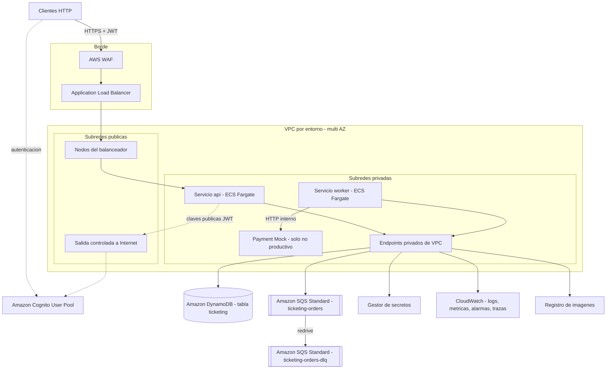

# AWS Target Topology — Ticketing Event Processing

Decisión que gobierna este documento: [ADR-018](adr/ADR-018-aws-target-topology.md). Relacionadas: [ADR-001](adr/ADR-001-dynamodb-data-model.md), [ADR-010](adr/ADR-010-sqs-operational-policy.md), [ADR-013](adr/ADR-013-security.md), [ADR-015](adr/ADR-015-clean-architecture-structure.md), [ADR-017](adr/ADR-017-local-topology.md).

Este documento es diseño. No contiene infraestructura como código ni prescribe su estructura. La topología AWS responde a los criterios `EVAL-005`, `EVAL-011`, `EVAL-012` y `EVAL-013`, que son criterios de evaluación y no requisitos. Ninguna cifra de este documento es una garantía de capacidad ni un SLA.

## 1. Target topology

Correspondencia con el entorno local: `api` y `worker` son los mismos procesos de la misma imagen que `ticketing-api` y `ticketing-worker`; la tabla y las colas tienen el mismo modelo lógico (`ticketing.data-model.md`, `ticketing.messaging.md`).

## 2. Compute

| Aspecto | Diseño |
|---|---|
| Plataforma | Amazon ECS sobre AWS Fargate |
| Servicios | `api` (rol `api`) y `worker` (rol `worker`: consumidor de SQS, proceso de expiración, limpieza de Events incompletos), ambos de la misma imagen (`ADR-015`) |
| Payment Mock | Tercer servicio, solo en entornos no productivos. En producción lo sustituye un proveedor real tras el mismo puerto |
| Distribución | Tareas repartidas en al menos dos zonas de disponibilidad |
| Mínimos | Producción: dos tareas por servicio. No productivo: una |
| Despliegue | Reemplazo progresivo con comprobación de salud; el `worker` se detiene de forma ordenada (deja de recibir y termina lo que está en vuelo) |
| Salud | `api`: comprobación HTTP de salud desde el balanceador. `worker`: comprobación de vida del contenedor |
| Imagen | Construcción en varias etapas, usuario sin privilegios, sistema de archivos raíz de solo lectura, almacenada en el registro de imágenes con análisis de vulnerabilidades |

Alternativas evaluadas y descartadas: funciones sin servidor y Kubernetes gestionado (ver ADR-018).

## 3. Networking and isolation

| Elemento | Diseño |
|---|---|
| VPC | Una por entorno, en al menos dos zonas |
| Subredes públicas | Solo nodos del balanceador y la salida controlada a Internet |
| Subredes privadas | Tareas `api`, `worker` y Payment Mock. Sin IP pública |
| Entrada | Balanceador de aplicación público, solo HTTPS, con certificado gestionado. AWS WAF asociado |
| Endpoints privados | Gateway para DynamoDB; de interfaz para SQS, registro de imágenes, logs, métricas y gestor de secretos |
| Salida a Internet | Solo para lo que no tenga endpoint privado: obtención de claves públicas de Cognito y, en producción, el proveedor de pagos real |
| Grupo de seguridad del balanceador | Entrada 443 desde Internet; salida solo al grupo de `api` |
| Grupo de seguridad de `api` | Entrada solo desde el balanceador; salida a endpoints privados y a la salida controlada |
| Grupo de seguridad de `worker` | Sin entrada; salida a endpoints privados y al Payment Mock |
| Grupo de seguridad del Payment Mock | Entrada solo desde `worker` |
| Aislamiento entre servicios | `api` no puede alcanzar al Payment Mock; `worker` no recibe tráfico |

## 4. Identity and access

### Identidad de usuarios

| Elemento | Diseño |
|---|---|
| Proveedor | User pool de Amazon Cognito por entorno (`TC-016`) |
| Roles | Grupos `ADMIN` y `CUSTOMER`, emitidos en `cognito:groups` (`FR-018`) |
| Cliente de aplicación | Uno para los consumidores de la API; el backend no guarda su secreto |
| Validación | En el backend, como Resource Server (`ADR-013`) |

### Mínimo privilegio por servicio

| Rol | Permisos |
|---|---|
| Rol de tarea `api` | Sobre la tabla y sus índices: lectura por clave, consulta, escritura por lotes, escritura y actualización de items, borrado de items, escritura transaccional. Sobre la cola principal: solo envío |
| Rol de tarea `worker` | Sobre la tabla y sus índices: lectura por clave, consulta, actualización y borrado de items, escritura por lotes, escritura transaccional. Sobre la cola principal: recepción, borrado, cambio de visibilidad y lectura de atributos. Sin envío |
| Rol de ejecución (por servicio) | Descarga de la imagen, escritura de logs y lectura de los secretos concretos que la tarea necesita |
| Política de las colas | Solo los roles anteriores, y solo con transporte cifrado |

Reglas: sin claves de acceso estáticas; permisos sobre recursos concretos, nunca comodines; ningún rol de aplicación puede crear, modificar ni borrar tablas, colas o índices; la DLQ no es escribible por los roles de aplicación.

## 5. Secrets and configuration

| Elemento | Diseño |
|---|---|
| Credenciales de AWS | Rol de tarea; ninguna credencial en configuración |
| API key del proveedor de pagos | Gestor de secretos, inyectada en la tarea `worker` al arrancar; rotación soportada |
| Validación de JWT | Solo datos públicos (emisor y claves públicas) |
| Configuración no sensible | Variables de entorno de la definición de la tarea, o almacén de parámetros: nombres de tabla y colas, emisor, límites y periodicidades |
| Cifrado en reposo | Tabla, colas, secretos y logs cifrados |
| Cifrado en tránsito | TLS hacia el balanceador y hacia todos los servicios gestionados |
| Repositorio e imagen | Sin secretos |
| Logs | Sin tokens, cabeceras de autorización ni claves |

## 6. Scalability

| Elemento | Diseño | Source IDs |
|---|---|---|
| `api` | Sin estado. Autoescalado por seguimiento de objetivo sobre uso de CPU y solicitudes por destino | NFR-007, EVAL-005 |
| `worker` | Autoescalado por mensajes pendientes por tarea | NFR-007, EVAL-005 |
| DynamoDB | On-demand; antes de una apertura de ventas conocida puede prepararse capacidad | NFR-006 |
| SQS | Absorbe el pico entre la aceptación síncrona y el procesamiento de pagos | EVAL-004 |
| Proceso de expiración | Corre en todas las tareas `worker`; seguro con múltiples instancias (`ADR-009`) | FR-011 |
| Límite conocido | Partición caliente por Event popular (`RISK-001`); ruta de evolución en `ADR-001` | — |

Resiliencia: tareas en varias zonas; reintentos acotados (`ADR-016`); DLQ (`ADR-010`); la expiración como red de seguridad de toda Order no cerrada (`ADR-009`); recuperación a un punto en el tiempo de la tabla.

## 7. Observability

| Señal | Diseño |
|---|---|
| Logs | JSON estructurado a la salida estándar, centralizado; con identificador de traza, `orderId` y `eventId` cuando aplican; retención acotada |
| Métricas técnicas | Latencia y errores por operación de la API; latencia, throttling y conflictos de DynamoDB; profundidad y antigüedad de la cola; profundidad de la DLQ; uso de recursos de las tareas |
| Métricas de negocio | Reservas creadas y rechazadas; Orders por estado terminal y causa; latencia del pago; demora de expiración (instante de liberación menos `expiresAt`); duplicados descartados; Orders expiradas sin haber sido encoladas; pagos aprobados sin Order confirmada |
| Trazas | Traza distribuida desde la solicitud HTTP, propagada por el atributo de traza del mensaje hasta el consumidor y la llamada de pago |
| Alarmas | DLQ con mensajes; antigüedad del mensaje más viejo; demora de expiración por encima de la tolerancia; tasa de errores de servidor; p95 por encima de los objetivos de prueba; throttling de DynamoDB; pago aprobado sin Order confirmada |
| Panel | Uno por entorno con las señales anteriores |
| Auditoría funcional | En la tabla (`ADR-012`); evolución: exportación a almacenamiento inmutable |
| Auditoría de infraestructura | Registro de llamadas a la API de AWS habilitado a nivel de cuenta |

## 8. Cost considerations

| Tema | Consideración |
|---|---|
| DynamoDB on-demand | Adecuado para carga impulsiva sin línea base; con carga estable y conocida, capacidad aprovisionada con autoescalado es más barata |
| Escrituras transaccionales | Consumen más capacidad que las simples; se acotan con el máximo de Ticket por Order (`FG-001`) |
| Lectura de disponibilidad | Su coste crece con la capacidad del Event; se acota con `FG-002` y lectura eventual (`ADR-021`) |
| Índices | Cada GSI añade escrituras; los tres son dispersos para minimizarlas |
| SQS | Long polling reduce recepciones vacías; retención corta en la cola principal |
| Cómputo | Coste base por tareas mínimas; el `worker` admite capacidad interrumpible porque su trabajo es reanudable |
| Red | La salida a Internet y los endpoints de interfaz tienen coste fijo por hora; en no productivo se usa una sola salida y solo los endpoints necesarios |
| Logs | Retención acotada y nivel de detalle configurable |
| Payment Mock | No se despliega en producción |
| Etiquetado | Etiquetas de entorno, aplicación y propietario en todos los recursos para atribución de costes |

Las tarifas concretas son `TO_VERIFY`; este documento no estima importes.

## 9. Environment isolation

| Aspecto | Diseño |
|---|---|
| Nivel de aislamiento | Una cuenta de AWS por entorno (desarrollo, preproducción, producción). Como mínimo aceptable: recursos separados por entorno dentro de una cuenta |
| Recursos por entorno | VPC, tabla, colas, user pool, secretos, roles, grupos de logs y registro de estado de la infraestructura propios |
| Nombres | Parametrizados por entorno; ningún recurso compartido |
| Acceso | Roles de despliegue distintos por entorno; producción sin acceso interactivo de escritura |
| Datos | Nunca se copian datos de producción a entornos inferiores |
| Promoción | La misma imagen se promueve entre entornos; solo cambia la configuración |
| Gobernanza | Etiquetado obligatorio, presupuestos y alertas de coste por entorno |

## 10. Local versus target differences

| Aspecto | Local (Docker Compose) | AWS objetivo | Justificación |
|---|---|---|---|
| Persistencia | DynamoDB Local | Amazon DynamoDB | `TC-004`; mismo modelo lógico |
| Mensajería | SQS en LocalStack | Amazon SQS | `TC-005`; mismas colas y política |
| Identidad | Emisor OIDC local con claims de forma Cognito | Amazon Cognito | Cognito en el emulador es `TO_VERIFY` (`ADR-014`); el backend valida igual |
| Proveedor de pagos | Payment Mock | Payment Mock en no productivo; proveedor real en producción | `TC-017` |
| Creación de recursos | Tarea de inicialización de un solo uso | Infraestructura como código | La aplicación no crea recursos en ningún entorno |
| Credenciales | Valores ficticios por variable de entorno | Roles de tarea | Los emuladores no aplican IAM |
| Secretos | Archivo de entorno no versionado | Gestor de secretos | — |
| Transporte | HTTP | HTTPS en el borde y hacia servicios gestionados | Sin certificados en local |
| Borde | Acceso directo al contenedor `api` | Balanceador y firewall de aplicación | El limitador de la aplicación es la única limitación por tasa en local |
| Escala | Una instancia de cada rol (ampliable manualmente) | Varias tareas con autoescalado | — |
| Particionado y throttling | No existen | Existen | `RISK-001`, `RISK-007` |
| Consistencia eventual | De hecho consistente | Realmente eventual en lecturas e índices | Las pruebas no deben depender de lectura inmediata |
| Observabilidad | Logs en salida estándar y endpoint de métricas de la aplicación | Logs, métricas, trazas y alarmas centralizados | — |
| Cifrado en reposo y respaldo | No | Sí | — |

Lo que no cambia: imagen de la aplicación, roles `api` y `worker`, modelo de datos, contrato HTTP, contrato de mensaje, política de reintentos y todas las condiciones de las transiciones.

## 11. Handoff to Platform/IaC

El agente Platform/IaC debe materializar, por entorno, lo siguiente. Este listado no prescribe la estructura del código de infraestructura.

| # | Recurso | Requisitos de diseño | Referencia |
|---|---|---|---|
| 1 | Red | VPC en al menos dos zonas; subredes públicas y privadas; salida controlada; endpoints privados para DynamoDB, SQS, registro de imágenes, logs, métricas y secretos | §3 |
| 2 | Grupos de seguridad | Los cuatro descritos, con las reglas de origen indicadas | §3 |
| 3 | Balanceador y certificado | Público, solo HTTPS, con comprobación de salud hacia `api` | §2, §3 |
| 4 | Firewall de aplicación web | Reglas gestionadas y regla por tasa | ADR-013 |
| 5 | Tabla DynamoDB | Claves `PK` y `SK`; índices `GSI1`, `GSI2`, `GSI3` con las claves y proyecciones definidas; TTL sobre el atributo `ttl`; on-demand; cifrado; recuperación a un punto en el tiempo | `ticketing.data-model.md` §2 |
| 6 | Colas SQS | Cola principal Standard y DLQ con los atributos definidos; política de redrive; cifrado; política de acceso restringida | `ticketing.messaging.md` §1 |
| 7 | User pool de Cognito | Grupos `ADMIN` y `CUSTOMER`; cliente de aplicación | §4 |
| 8 | Registro de imágenes | Con análisis de vulnerabilidades y política de retención | §2 |
| 9 | Clúster y servicios | Servicios `api` y `worker` (y Payment Mock en no productivo) con sus definiciones de tarea, variables y secretos | §2, §5 |
| 10 | Roles IAM | Roles de tarea y de ejecución con los permisos mínimos indicados | §4 |
| 11 | Secretos | API key del proveedor de pagos | §5 |
| 12 | Autoescalado | Políticas para `api` y `worker` | §6 |
| 13 | Observabilidad | Grupos de logs con retención, alarmas y panel | §7 |
| 14 | Aislamiento y gobernanza | Parametrización por entorno, etiquetado, estado de infraestructura separado | §9 |

Requisito de coherencia: la definición de la tabla y de las colas debe ser equivalente a la que crea la tarea de inicialización del entorno local (`ADR-017`).

Parámetros que la aplicación espera recibir por configuración: nombre de la tabla, URL de la cola principal, región, emisor y URL de claves del proveedor de identidad, URL y API key del proveedor de pagos, rol activo (`api` o `worker`) y los valores ajustables de `ADR-003`, `ADR-004`, `ADR-009` y `ADR-010`.
