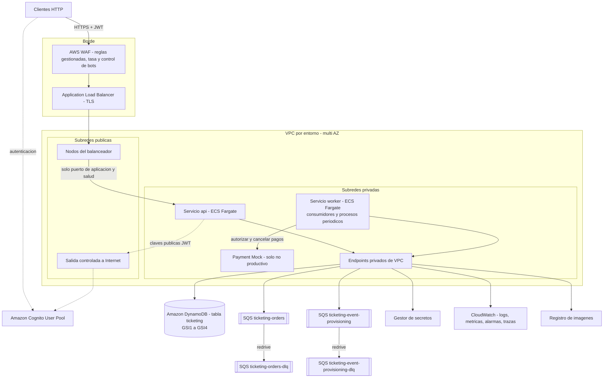

# AWS Target Topology v2 — Ticketing Event Processing

Decisión que gobierna este documento: [ADR-037](adr/ADR-037-aws-target-topology-v2.md). Relacionadas: [ADR-022](adr/ADR-022-dynamodb-data-model-ticket-partitioning.md), [ADR-024](adr/ADR-024-asynchronous-event-provisioning.md), [ADR-026](adr/ADR-026-persistence-plus-enqueue-with-republish-sweep.md), [ADR-028](adr/ADR-028-expiration-process-isolated-scheduling.md), [ADR-029](adr/ADR-029-sqs-operational-policy-orders-and-provisioning.md), [ADR-031](adr/ADR-031-audit-trail-extended-catalog.md), [ADR-032](adr/ADR-032-security-active-order-lock.md), [ADR-034](adr/ADR-034-clean-architecture-structure-independent-mock.md), [ADR-035](adr/ADR-035-error-model-reactive-retry-circuit-breaker.md), [ADR-036](adr/ADR-036-local-topology-v2.md). Reemplaza a `ticketing.aws-target.md` (versión 1, intacto).

Diseño, sin infraestructura como código. Responde a `EVAL-005`, `EVAL-011`, `EVAL-012`, `EVAL-013` (criterios de evaluación, no requisitos). Ninguna cifra es garantía de capacidad ni SLA.

## 1. Target topology

Correspondencia con local: `api` y `worker` son `ticketing-api` y `ticketing-worker` (misma imagen); tabla, índices y colas siguen `ticketing.data-model.v2.md` y `ticketing.messaging.v2.md`.

## 2. Compute

| Aspecto | Diseño |
|---|---|
| Plataforma | Amazon ECS sobre AWS Fargate |
| Servicio `api` | Rol `api`: `API-001` a `API-006`; publica `MSG-001` y `MSG-002` |
| Servicio `worker` | Rol `worker`: consumidores de `ticketing-orders` y `ticketing-event-provisioning`; procesos periódicos de expiración, barrido de republicación, reversos de pago y limpieza de aprovisionamiento con planificación independiente (ADR-028) |
| Payment Mock | Servicio propio desde su imagen independiente (ADR-034), solo no productivo |
| Distribución | Dos o más zonas |
| Mínimos | Producción: dos tareas por servicio. No productivo: una |
| Apagado ordenado | `api`: deja de aceptar, completa solicitudes en curso incluida la publicación en SQS. `worker`: detiene los bucles de recepción, completa mensajes en vuelo y ciclos en curso. Tiempo de parada superior a 30 s (`TO_VERIFY` máximo de la plataforma) |
| Salud | `api`: comprobación HTTP del endpoint de salud en el puerto de aplicación. `worker`: comprobación de vida del contenedor |
| Gestión | Métricas y demás endpoints de gestión en un puerto interno no registrado en el balanceador (ADR-032) |
| Imagen | Multi-etapa, usuario sin privilegios, raíz de solo lectura, análisis de vulnerabilidades |

## 3. Networking and isolation

| Elemento | Diseño |
|---|---|
| VPC | Una por entorno, dos o más zonas |
| Subredes públicas | Nodos del balanceador y salida controlada |
| Subredes privadas | `api`, `worker`, Payment Mock; sin IP pública |
| Entrada | ALB público solo HTTPS con certificado gestionado; WAF con reglas gestionadas, reglas por tasa y control de bots |
| Endpoints privados | Gateway para DynamoDB; interfaz para SQS, registro de imágenes, logs, métricas, secretos |
| Salida a Internet | Claves públicas de Cognito y, en producción, el proveedor de pagos real |
| SG del balanceador | Entrada 443 desde Internet; salida solo al puerto de aplicación de `api` |
| SG de `api` | Entrada solo desde el balanceador al puerto de aplicación; el puerto de gestión solo desde la red de observabilidad interna |
| SG de `worker` | Sin entrada salvo el puerto de gestión desde la red de observabilidad interna; salida a endpoints y al Payment Mock |
| SG del Payment Mock | Entrada solo desde `worker` (operaciones de pago) y desde la red interna de pruebas (API de control) |
| Aislamiento | `api` no alcanza al Payment Mock; `worker` no recibe tráfico de clientes |

## 4. Identity and access

### Identidad de usuarios

| Elemento | Diseño |
|---|---|
| Proveedor | User pool de Cognito por entorno (`TC-016`) |
| Grupos | `ADMIN`, `CUSTOMER` en `cognito:groups` |
| Cliente de aplicación | Uno para los consumidores de la API; el backend no guarda su secreto |
| Validación | En el backend como Resource Server (ADR-032) |

### Mínimo privilegio por servicio

| Rol | DynamoDB (tabla `ticketing` e índices concretos) | SQS |
|---|---|---|
| Rol de tarea `api` | Lectura por clave, consulta (`GSI1`, `GSI2`), actualización de item (`enqueuedAt`), escritura transaccional | Envío a `ticketing-orders` y a `ticketing-event-provisioning` |
| Rol de tarea `worker` | Lectura por clave, lectura por lotes, consulta (`GSI1` a `GSI4`), actualización de item, escritura por lotes (incluye borrado de Ticket en la purga), escritura transaccional | Recepción, borrado, cambio de visibilidad y lectura de atributos en `ticketing-orders` y `ticketing-event-provisioning`; envío a ambas (barrido y detección de estancados) |
| Rol de tarea del Payment Mock | Ninguno | Ninguno |
| Rol de ejecución (por servicio) | — | — ; descarga de imagen, logs, lectura de los secretos concretos de la tarea |

Reglas: sin claves estáticas; recursos concretos, sin comodines; ningún rol de aplicación crea, modifica o borra tablas, índices o colas; las DLQ no son escribibles por los roles de aplicación; políticas de las colas restringidas a estos roles y a transporte cifrado. Como la auditoría comparte partition key con su Order, IAM no puede separar su escritura (limitación declarada en ADR-031).

## 5. Secrets and configuration

| Elemento | Diseño |
|---|---|
| Credenciales de AWS | Rol de tarea |
| API key del proveedor de pagos | Gestor de secretos, inyectada en `worker` (y en el Payment Mock no productivo) |
| Validación de JWT | Solo datos públicos |
| Configuración no sensible | Variables de la definición de tarea o almacén de parámetros: nombres de tabla y colas, emisor, límites (ADR-003, ADR-024), periodicidades (ADR-028), parámetros de colas (ADR-029), presupuestos y circuit breakers (ADR-035), límite de cuerpo (ADR-032) |
| Cifrado | En reposo para tabla, colas, secretos, logs; TLS en el borde y hacia servicios gestionados |
| Repositorio, imagen y logs | Sin secretos, tokens ni API keys |

## 6. Scalability

| Elemento | Diseño | Source IDs |
|---|---|---|
| `api` | Sin estado; seguimiento de objetivo sobre CPU y solicitudes por destino | NFR-007, EVAL-005 |
| `worker` | Mensajes pendientes por tarea de `ticketing-orders` y antigüedad del mensaje más antiguo (alarma a 2 min); máximo de tareas acotado | NFR-007, EVAL-005, ADR-029 |
| DynamoDB | On-demand; Ticket con partition key propia; `GSI2` con hasta 32 shards por Event; `GSI3` y `GSI4` con 8 shards; precalentamiento (warm throughput) antes de ventas masivas como mejora productiva (`TO_VERIFY`) | NFR-006, ADR-022 |
| SQS | Absorbe picos entre aceptación y pago, y entre creación y aprovisionamiento | EVAL-004 |
| Procesos periódicos | En todas las tareas `worker`, seguros sin coordinación (ADR-028) | FR-011 |
| Aprovisionamiento | Concurrencia 1 por tarea y 4 escrituras por lotes en paralelo, para no competir con las compras | ADR-029 |

Resiliencia: varias zonas; circuit breakers con pausa del consumo (ADR-035); DLQ por cola; barrido de republicación; expiración como última garantía; detección de estancados; PITR.

## 7. Observability

| Señal | Diseño |
|---|---|
| Logs | JSON estructurado; traza, `orderId`, `eventId`; sin tokens; retención acotada |
| Métricas técnicas | Latencia y errores por operación; latencia, throttling y conflictos de DynamoDB; profundidad y antigüedad de ambas colas y DLQ; estado de cada circuit breaker; aciertos del caché del recuento de disponibles; recursos de las tareas |
| Métricas de negocio | Reservas creadas y rechazadas por código; Orders por estado terminal y causa; latencia del pago; `expiration lag`; duplicados descartados; Orders republicadas por el barrido; Orders expiradas sin encolar o sin intento de pago; reversos pendientes, confirmados y agotados; Orders en cuarentena; aprovisionamientos iniciados, completados, fallidos y su duración |
| Trazas | Desde la solicitud HTTP, propagadas por los atributos de los mensajes, hasta el consumidor, la llamada de pago y el aprovisionamiento |
| Alarmas | Catálogo de ADR-037: DLQ de Orders y de aprovisionamiento; antigüedad > 2 min; retraso de expiración > 15 s; apertura de cada circuit breaker; reversos pendientes o agotados; Orders en cuarentena; aprovisionamientos fallidos; además 5xx, p95 sobre objetivos de prueba y throttling |
| Panel | Uno por entorno |
| Auditoría funcional | En la tabla (ADR-031); mejora productiva: captura de cambios a almacenamiento con bloqueo de objetos y retención |
| Auditoría de infraestructura | Registro de llamadas a la API de AWS a nivel de cuenta |

## 8. Cost considerations

| Tema | Consideración |
|---|---|
| DynamoDB on-demand | Adecuado para carga impulsiva |
| Escrituras transaccionales | Doble capacidad; tres por compra confirmada (trade-off aceptado, ADR-025) |
| Índices | `GSI2` N salidas por compra (y N reentradas si no se confirma); `GSI3` y `GSI4` dos escrituras cada uno por Order (ADR-026) |
| Recuento de disponibles | Hasta 32 consultas por recuento, mitigadas por el caché de 1 s y la consulta compartida |
| Sondeo de agotados | Hasta 32 consultas por Event agotado en el listado (`RISK-023`) |
| Aprovisionamiento | Una escritura por Ticket y una lectura consistente por Ticket en la verificación, una vez por Event |
| SQS | Long polling; retenciones cortas en colas principales |
| Cómputo | Coste base por tareas mínimas; el `worker` admite capacidad interrumpible porque su trabajo es reanudable |
| Red | Salida y endpoints de interfaz con coste por hora; en no productivo una salida |
| WAF con control de bots | Coste adicional aceptado (ADR-037) |
| Logs | Retención acotada |
| Payment Mock | No se despliega en producción |
| Etiquetado | Entorno, aplicación, propietario |

Tarifas `TO_VERIFY`; sin estimación de importes.

## 9. Environment isolation

| Aspecto | Diseño |
|---|---|
| Nivel | Una cuenta de AWS por entorno (desarrollo, preproducción, producción) |
| Recursos por entorno | VPC, tabla, cuatro colas, user pool, secretos, roles, logs, estado de infraestructura |
| Nombres | Parametrizados por entorno |
| Acceso | Roles de despliegue por entorno; producción sin escritura interactiva |
| Datos | Nunca se copian de producción a inferiores |
| Promoción | Misma imagen; solo cambia la configuración |
| Gobernanza | Etiquetado obligatorio, presupuestos y alertas de coste |

## 10. Local versus target differences

| Aspecto | Local (Docker Compose) | AWS | Justificación |
|---|---|---|---|
| Persistencia | DynamoDB Local | DynamoDB | `TC-004`; mismo modelo |
| Mensajería | LocalStack fijado a un tag anterior al 23-03-2026, o versión actual con token, o ElasticMQ previa revisión funcional (ADR-036) | SQS | `TC-005`; mismas cuatro colas y políticas |
| Identidad | Emisor OIDC local con sujetos arbitrarios y cinco identidades deterministas (ADR-033) | Cognito | `TC-016` |
| Pagos | Payment Mock | Payment Mock no productivo; proveedor real en producción | `TC-017` |
| Creación de recursos | `infra-init` | IaC | La aplicación no crea recursos |
| Credenciales y secretos | Ficticias y archivo no versionado | Roles y gestor de secretos | — |
| Transporte | HTTP | HTTPS | — |
| Borde | Acceso directo a `ticketing-api`; limitador en memoria | ALB, WAF con tasa y control de bots | — |
| Puerto de gestión | Publicado al host para inspección | Interno, no registrado | ADR-032 |
| Escala | Una instancia por rol | Autoescalado | — |
| Particionado y throttling | No existen | Existen | Beneficio del particionado por Ticket solo observable en AWS (`RISK-007`) |
| Consistencia eventual | Casi inmediata | Real | Pruebas sin dependencia de lectura inmediata |
| Observabilidad | Logs y métricas locales | Centralizada con alarmas | — |
| Cifrado, PITR | No | Sí | — |

No cambia: imagen, roles, modelo de datos, contratos HTTP y de mensajes, políticas de reintento y circuit breaker, condiciones de las transiciones.

## 11. Handoff to Platform/IaC

El agente Platform/IaC debe materializar por entorno lo siguiente, sin que este listado prescriba la estructura del código de infraestructura.

| # | Recurso | Requisitos de diseño | Referencia |
|---|---|---|---|
| 1 | Red | VPC multi-AZ; subredes públicas y privadas; salida controlada; endpoints privados (DynamoDB, SQS, registro de imágenes, logs, métricas, secretos) | §3 |
| 2 | Grupos de seguridad | Balanceador, `api`, `worker`, Payment Mock, con las reglas de §3 incluido el puerto de gestión interno | §3 |
| 3 | Balanceador y certificado | Público, HTTPS, comprobación de salud al endpoint de salud de `api`; solo el puerto de aplicación registrado | §2, §3 |
| 4 | WAF | Reglas gestionadas, reglas por tasa, control de bots | ADR-037 |
| 5 | Tabla DynamoDB | `PK`/`SK`; `GSI1`, `GSI2`, `GSI3`, `GSI4` con claves y proyecciones de `ticketing.data-model.v2.md` §2; TTL en `ttl`; on-demand; cifrado; PITR | data model v2 |
| 6 | Colas SQS | `ticketing-orders`, `ticketing-orders-dlq`, `ticketing-event-provisioning`, `ticketing-event-provisioning-dlq` con los atributos y redrive de `ticketing.messaging.v2.md` §1; cifrado; políticas restringidas | messaging v2 |
| 7 | User pool de Cognito | Grupos `ADMIN`, `CUSTOMER`; cliente de aplicación | §4 |
| 8 | Registro de imágenes | Repositorios para `ticketing` y `payment-mock`, con análisis y retención | §2 |
| 9 | Clúster y servicios | `api`, `worker` (y Payment Mock no productivo); definiciones de tarea con variables, secretos, puertos de aplicación y gestión, tiempo de parada | §2, §5 |
| 10 | Roles IAM | Roles de tarea y de ejecución de §4 | §4 |
| 11 | Secretos | API key del proveedor de pagos | §5 |
| 12 | Autoescalado | `api` por CPU y solicitudes; `worker` por pendientes por tarea y antigüedad del mensaje más antiguo de `ticketing-orders`, con máximo | §6 |
| 13 | Observabilidad | Grupos de logs con retención; métricas personalizadas; catálogo de alarmas de ADR-037; panel | §7 |
| 14 | Aislamiento y gobernanza | Parametrización por entorno, etiquetado, estado separado, presupuestos | §9 |
| 15 | Mejoras productivas (opcional, declaradas) | Captura de cambios a almacenamiento con bloqueo de objetos; warm throughput de tabla e índices | ADR-031, ADR-037 |

Coherencia: la definición de tabla, índices y colas debe ser equivalente a la que crea `infra-init` (ADR-036).

Parámetros que la aplicación espera por configuración: tabla; URLs de ambas colas; región; emisor, URL de claves y nombres de claims; URL y API key del proveedor de pagos; rol activo; y los valores ajustables de ADR-003, ADR-024, ADR-026, ADR-028, ADR-029, ADR-032, ADR-035 y ADR-040.
